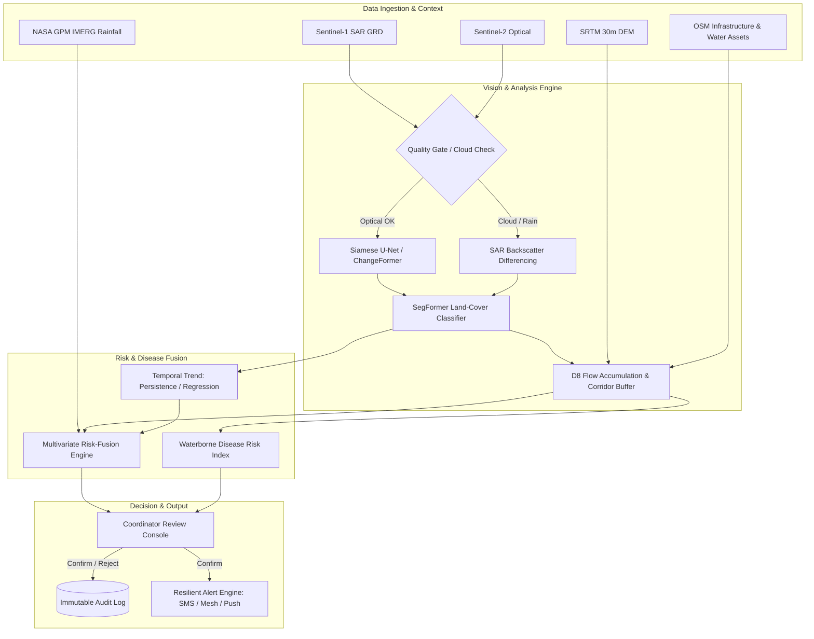

# SIREN

## Satellite-Informed Risk & Emergency Network

**Product Requirements Document**

| | |
|---|---|
| **Version** | 4.3 (Canonical — consolidates drafts v1.0–v3.0; v4.1 renames SafeBasin → SIREN; v4.2 adds combined D8+OSM corridor, UI design spec, verified demo assets; v4.3 reflects implemented state with pipeline orchestrator, 104 passing tests, verified DoD chain, ML evidence layer, SAR priority, SHA-256 audit hash chain) |
| **Target track** | Track 7 — *Living with Uncertainties, Building with Resilience* |
| **Track areas** | Area ii: Communication Systems During Disasters for Effective Response · Area iii: Curbing Diseases That Arise During Disasters |
| **Demo geography** | Dudh Koshi / Imja glacial basin, Nepal Himalaya (swap-ready to Chorabari/Kedarnath or South Lhonak if Indian terrain resonates better with judges; pipeline is basin-agnostic) |
| **Event** | >.hack();'26, 7th Edition — 36-hour execution window |
| **Status** | Implemented — DoD chain verified end-to-end (104/104 tests passing) |

---

## 1. Executive Summary

SIREN is a human-in-the-loop, satellite-assisted early-warning and disaster-response platform for vulnerable Himalayan basins. It fuses Synthetic Aperture Radar (SAR) and optical Earth-observation scenes with rainfall, terrain, river, population, and infrastructure data to model hazard progression and downstream exposure. The system surfaces evidence to an authorized emergency coordinator through an explainable review console and — only after human confirmation — dispatches a geofenced, bandwidth-light alert alongside a disease-prevention action sheet for affected water and health infrastructure.

The core problem is not that satellite data is unavailable — it is that **observations remain disconnected from operational response** under exactly the conditions Track 7 names: limited time, limited infrastructure, and severed communication. A change in a glacial lake, river corridor, or unstable slope has no operational value until a system converts it into an answer to four questions:

> **What changed? How serious is it? Who and what are in the path? What should responders do right now?**

```text
Sentinel-1 SAR / Sentinel-2 Optical / SRTM DEM / GPM IMERG / OSM
                        ↓
        Preprocessing, co-registration & quality gate
                        ↓
   Weather-adaptive router (cloud ≥20% → SAR path)
                        ↓
   SAR backscatter differencing  ⇄  Optical NDWI differencing
                        ↓
        D8 + OSM hydrological corridor & exposure analysis
                        ↓
    Risk fusion (H + E + D_risk) + disease-prevention actions
                        ↓
                  Human-in-the-loop review
                        ↓
   Resilient geofenced dispatch (Track 7.ii)  +  audit log
```

SIREN does not predict the exact time of a glacial-lake outburst, and it does not issue autonomous evacuation orders. It identifies warning indicators, estimates exposure, prioritizes verification, and compresses the time between "something changed" and "the right people know what to do about it."

---

## 2. Problem Statement & Track Alignment

Mountain communities in the Himalayas face cascading hazards — extreme rainfall, flash floods, landslides, glacial-lake outburst floods (GLOFs), debris flows, road and bridge failures, and communication blackouts. The same event cascades through a chain of systems: a high-altitude lake or slope changes first, a river corridor becomes dangerous next, and downstream settlements, roads, bridges, hospitals, shelters, and water supplies are affected afterward.

Two operational failure modes compound this, and they map directly onto Track 7's two named areas:

**Area ii — Communication systems during disasters.** Ground networks collapse when roads, bridges, and cell towers are washed out by flash floods or GLOFs — often exactly when coordination matters most. SIREN's alert payload is designed for constrained links (compressed SMS, LoRa mesh, satellite messengers) so a verified warning can still travel when conventional infrastructure can't.

**Area iii — Disease prevention following disasters.** Waterborne disease is one of the largest secondary killers after flooding — contaminated wells, submerged sanitation, and severed clinic access. SIREN intersects the detected inundation polygon with municipal water points, wells, and health facilities to generate an immediate contamination-priority list, so water-purification and medical response can be dispatched within hours, not after outbreak onset.

**Area i — Personnel identification.** SIREN's MVP does not identify individuals. It serves Area i *indirectly* through rescue-prioritization: exposure corridors, road-cut analysis, and settlement-level population estimates tell SAR teams where affected people are and which access routes are severed. Deeper Area i capabilities (missing-persons registry, survivor identification, family reunification) are explicit roadmap items (§18), not MVP scope — by design, since individual-level tracking conflicts with the privacy constraints in §13.

Current disaster workflows are fragmented across satellite providers, weather services, terrain data, field reports, and alerting authorities — usually manually reconciled by an analyst under time pressure. Earth-observation imagery also has real constraints: optical sensors are blinded by monsoon cloud cover, satellite passes are periodic rather than continuous, and processing latency varies (Sentinel-1 NRT typically delivers 1–3 hours post-overpass). A responsible system must combine multiple evidence sources, expose its own uncertainty, and keep a human at the decision point before any public communication goes out.

### 2.1 Product problem statement

> Emergency coordinators need a faster, explainable, and weather-resilient way to turn new satellite and environmental observations into localized hazard assessments, downstream exposure maps, disease-risk flags, and verified alerts for communities and critical infrastructure in Himalayan basins.

### 2.2 Product hypothesis

If SIREN automatically compares new SAR/optical observations against a historical baseline, fuses the resulting change signal with weather, terrain, and infrastructure exposure, and routes the evidence through a human-review workflow, emergency teams can identify priority zones, verify warnings, and trigger disease-prevention response measurably faster than through manual, disconnected analysis — particularly during the cloud-covered monsoon windows when optical-only systems go blind.

---

## 3. Product Vision

> **SIREN turns changing conditions observed from space into understandable, location-specific action on the ground — even when the ground loses power, signal, and visibility.**

The platform is a decision-support layer connecting Earth observation, environmental intelligence, emergency operations, and community protection. Its architecture generalizes beyond one disaster type: flood expansion, glacial-lake monitoring, landslide indicators, river obstruction, infrastructure exposure, post-event damage assessment, and — per Track 7 — the disease and communication response layers that follow a hazard event.

---

## 4. Users & Stakeholders

| User | Need | SIREN Value |
|---|---|---|
| Emergency coordinator | Decide fast whether a detected change requires action | Evidence panel, composite hazard score, explainable review workflow |
| Disaster-management authority | Identify exposed settlements and access routes | Geofenced exposure corridor with infrastructure tolerance buffers |
| Public health & water response team | Prevent outbreaks from flooded water/sanitation sources | Post-flood water-contamination priority map, disease action sheet |
| Search-and-rescue team | Know which roads, bridges, and corridors are compromised | Priority asset-failure layer, road-cut map |
| Field responder / community | Receive a clear, verified warning despite network loss | Compressed, geofenced alert deliverable over constrained links |
| Remote-sensing analyst | Inspect evidence and model confidence | Before/after rasters, change masks, metadata, provenance |

The primary MVP user is an **authorized emergency coordinator**. The public alert recipient experience is simulated for the hackathon and, in a real deployment, must be routed through an approved alerting authority.

---

## 5. Product Principles

1. **Evidence-led.** Every alert must show the observations and features that produced the assessment.
2. **Human-supervised.** The system prioritizes and recommends; a human confirms anything that leaves the system.
3. **Uncertainty-aware.** Cloud cover, missing data, misalignment, and low image quality reduce confidence — they are never silently treated as "safe."
4. **Weather-resilient.** Where optical sensing fails, SAR takes over automatically. Monsoon cloud cover is the expected case in the Himalayas, not the edge case.
5. **Operationally useful.** Output identifies specific communities, roads, bridges, clinics, shelters, and water points — never just a red polygon.
6. **Realistic about latency.** Satellite data is periodic/near-real-time (Sentinel-1 NRT typically 1–3 hours post-overpass), never framed as a live camera feed.

---

## 6. Core Product Workflow

```
[6.1 Ingestion] ──► [6.2 QC & Co-registration] ──► [6.3 SAR / Optical Change Detection]
                                                                │
[6.6 Human Review] ◄── [6.5 Risk + Disease Fusion] ◄── [6.4 Corridor & Exposure Mapping]
        │
        ▼
[6.7 Resilient Dispatch + Audit Log]
```

**6.1 Observation ingestion.** Pulls Sentinel-1 GRD SAR and Sentinel-2 L2A optical scenes via the Copernicus Data Space Ecosystem (STAC API), plus NASA GPM IMERG rainfall and Open-Meteo forecast context. Every observation records source, acquisition time, processing time, spatial footprint, and quality metadata.

**6.2 Preprocessing, co-registration, and quality gate.** Scenes are clipped to the basin boundary, reprojected onto the SRTM baseline grid, and checked for cloud cover, missing pixels, and alignment error. If optical cloud fraction exceeds ~20%, the pipeline automatically promotes Sentinel-1 SAR to the primary change-detection path — SAR backscatter is unaffected by cloud or darkness. The gate outputs a usability verdict and a confidence multiplier, never a silent pass.

**6.3 Change detection (hybrid, weather-adaptive).**
- *SAR path (primary during cloud/monsoon conditions):* dual-polarization (σ⁰VV, σ⁰VH) backscatter differencing and ratio thresholding flags open-water expansion and surface scouring regardless of weather or daylight.
- *Optical path (used when skies are clear):* NDWI plus a Siamese U-Net / ChangeFormer model — shared encoders over baseline and current imagery, decoded into a pixel-level change-probability map and category (water expansion, floodwater, debris, glacier change, uncertain).
- A SegFormer head classifies changed pixels into functional classes: open water, inundation/debris, glacier/snow, moraine/bare rock, forest, built-up, cloud/shadow.

**6.4 Temporal trend, hydrological corridor, and exposure mapping.** Two-to-four observations are compared chronologically; persistence across multiple passes is required before escalation (stable / slowly expanding / rapidly expanding / uncertain — never a precise collapse time). The downstream exposure corridor uses a **combined D8 + OSM river buffering** approach (ADR-005 / Roadmap Phase 3):

1. **D8 reachability (physical validation):** SRTM-derived D8 flow accumulation traces the downstream flow path from the change polygon centroid, confirming the change source drains into the expected sub-basin (e.g., Imja lake → Imja Khola / Dudh Koshi) rather than an adjacent drainage divide.
2. **OSM river selection:** waterway segments (`waterway=river/stream`) reachable by the D8 path are selected — these capture the real, surveyed riverbed through inhabited valleys, which a single-pixel D8 path at 30 m resolution can miss in steep terrain (drainage-trenching artifacts, lateral moraine walls).
3. **Floodplain buffer:** the reachable river segments are buffered by a nominal flood-plain width (100–150 m).
4. **Exposure intersection:** the buffered corridor is intersected against OSM-sourced settlements, roads, bridges, hospitals, shelters, water points, and food facilities using resolution-aware tolerance buffers (bridges ±75 m, roads ±50 m, settlements/wells ±100 m) to avoid false intersections at 10–30 m satellite resolution.

**6.5 Risk fusion and disease-risk scoring.** Satellite change, temporal trend, rainfall, terrain, hydrology, and exposure combine into a hazard score, exposure priority, and a waterborne-disease risk index (§9.5). A policy engine classifies the result as informational, watch, elevated, or eligible for critical human review.

**6.6 Human-in-the-loop review.** The coordinator sees an interactive card: before/after rasters, the change overlay, hazard and confidence scores, the affected-asset list, the disease action sheet, and a decision control — **Confirm**, **Reject**, or **Postpone / Request local verification**.

**6.7 Resilient dispatch and audit.** A confirmed alert is compressed into a low-bandwidth payload and dispatched in simulation mode to a geofenced recipient set (SMS / push / LoRa-mesh / satellite-messenger format). Every run, model version, input snapshot, reviewer decision, and dispatch action is written to an append-only audit log.

---

## 7. Functional Requirements

**7.1 Monitoring and data management.** Authorized users configure a basin boundary, monitoring layers, and alert recipients; the system supports a baseline observation plus a sequence of subsequent observations, each retaining source, date, spatial reference, quality metadata, and processing status.

**7.2 Multi-sensor ingestion and preprocessing.** Ingest Sentinel-1 (IW, GRD) and Sentinel-2 (L2A) via STAC APIs; clip to basin polygon, project to WGS 84/UTM, extract backscatter and spectral values; maintain an offline-resilient local GeoTIFF/COG cache for demo reliability without live network dependency.

**7.3 Change detection and risk assessment.** Align observations to a common grid, calculate a water/change mask and change statistics, and expose both original and processed layers on the map. Calculate a transparent hazard score and separate exposure-priority score, always paired with the evidence and confidence behind it.

**7.4 GIS corridor and exposure mapping.** Compute downstream flowlines from the change polygon via terrain slope; query OSM/Overpass layers for critical facilities (settlements, roads, bridges, hospitals, shelters, water points, food facilities) inside or near the corridor.

**7.5 Disease-prevention action layer (Track 7.iii).** Detect submerged or encircled water points, storage tanks, and clinics; auto-generate a Disease Prevention Action Sheet (e.g., water purification dispatch, boil-water advisory) targeted to the affected geofenced zone.

**7.6 Human review.** Create a review card for elevated/critical results showing the image timeline, change overlay, hazard and confidence scores, affected assets, disease flags, recommended actions, and a decision control.

**7.7 Resilient alerting (Track 7.ii).** Support simulated geofenced dispatch over SMS/push and a compressed (<250 byte) payload format suitable for LoRa mesh or satellite messengers; log recipient groups, message content, status, timestamp, and alert zone. Real public alerting requires authenticated authority approval and an approved channel integration.

**7.8 Auditability.** Preserve every run, model version, input snapshot, risk result, reviewer decision, and alert action so a later user can reconstruct why an alert was created and how it was handled.

---

## 8. Recommended Stack (implementation guidance)

Chosen for a 2–3 person team in 36 hours; every choice optimizes for "working end-to-end demo" over sophistication.

| Layer | Choice | Rationale |
|---|---|---|
| Pipeline / backend | Python 3.11+, FastAPI | Geospatial ecosystem (rasterio, geopandas, xarray) is unmatched; FastAPI gives typed endpoints for free |
| Raster ops | rasterio, numpy, xarray | COG read/write, reprojection, NDWI/backscatter math |
| Hydrology (D8) | WhiteboxTools (pysheds fallback) | Battle-tested D8 flow accumulation; pysheds is pure-Python fallback if binary install fails |
| Vector ops | geopandas + shapely | Buffer/intersect against OSM layers |
| Database | SQLite (JSON columns) + GeoJSON files on disk | Zero-ops, offline-safe; PostGIS is the V2 migration path |
| Frontend | React + Vite + TypeScript | Fast scaffolding, typed API contracts |
| Map | MapLibre GL JS | Free, no token, raster+vector overlays, swipe-compare support |
| State/data | TanStack Query | Polling for pipeline run status |
| ML (optional) | PyTorch + pretrained Siamese U-Net weights (Sen1Floods11) | Only if hours 0–16 go well; deterministic baseline is the deliverable |

**Key tradeoff:** SQLite over PostGIS sacrifices spatial indexing for zero setup time. All spatial joins run in-memory via geopandas on a small basin extract (<100 MB), so this is safe at hackathon scale.

---

## 9. Hybrid AI & Computational Architecture

SIREN is a hybrid pipeline — deterministic physical modeling plus deep-learning vision — deliberately avoiding a single black-box model so every score stays explainable.



### 9.1 Quality gate

```json
{
  "quality_score": 0.88,
  "cloud_fraction": 0.11,
  "alignment_ok": true,
  "usable": true,
  "confidence_adjustment": 0.95
}
```

Confidence multiplier = (1.0 − cloud_fraction) × sensor-freshness weight. For a cloud-blocked optical scene, the gate routes to SAR and sets `cloud_fraction: 0.0` for that path — SAR is treated as all-weather capable.

### 9.2 Change detection & segmentation

**Implemented (MVP):** registered raster differencing plus NDWI (optical, `detect/ndwi.py`) and SAR backscatter log-ratio thresholding with multi-look speckle suppression and DEM slope masking (`detect/sar.py`). Scenario masks (`detect/scenario.py`) provide deterministic, reproducible demo masks near the Imja lake when the available SAR swath doesn't cover the change source.

**Research-grade (V3 roadmap):** fine-tuned Siamese U-Net or ChangeFormer with shared encoders over baseline and current imagery, decoded into a pixel-level change-probability map. SegFormer classifies changed regions into: open water, inundation/debris, glacier/snow, moraine/bare rock, built-up, forest, cloud/shadow-invalid.

### 9.3 Temporal trend model

**Implemented (MVP):** deterministic trend classification (`stable | slowly | rapidly | uncertain`) configured per observation in the pipeline orchestrator. The trend class feeds the hazard score's S_trend factor (weight 0.30).

**Research-grade (V3 roadmap):** ConvLSTM or temporal Transformer once enough labeled sequences exist. Output classification remains stable / slowly changing / rapidly changing / uncertain — deliberately never a precise event-time prediction.

### 9.4 GIS exposure engine

Deterministic spatial analysis (not learned) for MVP transparency and easy validation. The engine combines two evidence sources (see §6.4):

- **D8 flow accumulation** validates the gravity gradient — that floodwater from the change source drains into the expected sub-basin.
- **OSM river buffering** captures the real surveyed riverbed through inhabited valleys, which a raw D8 path can miss at 30 m resolution in steep Himalayan terrain.

The engine intersects the buffered corridor with terrain and asset layers using the tolerance buffers in §6.4. A future graph neural network could rank connected-asset failure cascades, but the MVP stays deterministic by design.

### 9.5 Risk-fusion and disease scoring

**Implemented** in `backend/siren/risk/fusion.py`. Every score carries a deterministic `reasons` array (≥3 entries on elevated+ — Hard Rule 5).

**Hazard score:**

```text
H = 0.30 × satellite-change trend (S_trend)
  + 0.25 × water-area expansion (A_expansion)
  + 0.20 × rainfall / snowmelt indicator (R_rain, 24h + 7d)
  + 0.15 × terrain and slope risk (T_slope)
  + 0.10 × downstream proximity (D_prox)
```

**Exposure priority:**

```text
E = H × Population Vulnerability × Critical Infrastructure Weight
```

**Waterborne disease risk index (Track 7.iii):**

```text
D_risk = Inundated Water Points × Population Density × Temperature Index
```

`D_risk` flags zones for immediate water-purification and medical-supply dispatch — it is explicitly a triage priority signal, not a medical diagnosis.

Initial deployment uses explainable weighted scoring; XGBoost/LightGBM fusion becomes viable once historical event labels are available. Every score displayed to a coordinator is accompanied by the reasons behind it, never a bare number.

### 9.6 Explanation layer

Deterministic templates generate evidence summaries for safety-critical output. An optional LLM may rephrase structured evidence but must be schema-constrained: it receives only the validated risk object and may not invent measurements, locations, or confidence values.

---

## 10. Data Pipeline & Contracts

### 10.1 Pipeline steps

```text
 1. Select basin and time range
 2. Acquire scenes and contextual datasets (or load from local cache)
 3. Validate provenance and spatial metadata
 4. Clip, reproject, resample, align to SRTM baseline grid
 5. Apply cloud and invalid-pixel masks
 6. Run weather-adaptive change detection (SAR and/or optical path)
 7. Extract water, glacier, debris, and change statistics
 8. Join rainfall, temperature, and hydrology features
 9. Derive slope, drainage, river proximity, and exposure features
10. Calculate temporal persistence and trend
11. Intersect hazard polygon + corridor with settlements and infrastructure
12. Fuse evidence into hazard, exposure, and disease-risk scores
13. Apply data-quality and alert policies
14. Create human-review alert
15. Confirm, reject, or postpone
16. Dispatch simulated geofenced alert if confirmed
17. Store complete audit record
```

### 10.2 Observation data contract

```json
{
  "observation_id": "obs-003",
  "basin_id": "dudh-koshi-demo-01",
  "acquired_at": "2026-08-12T12:00:00Z",
  "source": "sentinel-1-grd-nrt",
  "raster_uri": "data/processed/obs-003.tif",
  "crs": "EPSG:4326",
  "quality_score": 0.88,
  "cloud_fraction": 0.0,
  "optical_cloud_fraction": 0.90,
  "alignment_ok": true,
  "usable": true,
  "confidence_adjustment": 0.95,
  "water_area_km2": 4.3,
  "water_area_change_percent": 43.0,
  "rainfall_24h_mm": 60.0,
  "rainfall_7d_mm": 160.0,
  "mean_slope_degrees": 31.0,
  "processing_version": "0.1.0",
  "status": "processed"
}
```

### 10.3 Alert data contract

```json
{
  "alert_id": "alert-0091",
  "geofence_id": "sector-b",
  "severity": "HIGH",
  "hazard_type": "possible_flood_or_debris_flow",
  "confidence": 0.76,
  "exposed_population": 1248,
  "critical_assets": ["bridge-12", "road-4", "village-2"],
  "disease_flags": ["well-3-submerged", "well-7-encircled"],
  "recommended_action": "Verify locally and prepare downstream warning",
  "human_review_required": true
}
```

### 10.4 Resilient compressed payload (Track 7.ii)

Confirmed alerts serialize to <250 bytes for LoRa mesh / satellite messenger / low-bandwidth SMS:

```json
{"aid":"siren-04","sec":"B","haz":"GLOF_FL","lvl":3,"exp_pop":1240,"crit":["BR-12","RD-4"],"med_act":"BOIL_WATER_NOW"}
```

The public-facing message avoids false certainty:

> **Potential flood or debris-flow risk detected in Sector B. Follow instructions from local authorities, avoid the downstream river corridor, and move toward the designated shelter if instructed.**

---

## 11. Dataset Plan

| Dataset | Type / Source | Role in SIREN | Storage |
|---|---|---|---|
| Sentinel-1 C-SAR | Copernicus CDSE, 10 m GRD | All-weather backscatter differencing for water/debris tracking | GeoTIFF/COG + metadata |
| Sentinel-2 MSI | Copernicus CDSE, 10–20 m multispectral | Cloud-free optical NDWI and Siamese U-Net segmentation | GeoTIFF/COG + metadata |
| SRTM 1 Arc-Second | NASA Earthdata, 30 m DEM | Elevation, slope angle, D8 downstream hydrological flow | Raster DEM |
| GPM IMERG | NASA GES DISC, 0.1° NRT | Basin-wide antecedent rainfall and storm-intensity metrics | NetCDF/GeoTIFF/feature table |
| Open-Meteo | HTTP API | Development weather and soil-moisture context | JSON time series |
| OpenStreetMap (HOT) | Humanitarian OSM Team vectors | Roads, bridges, clinics, schools, and municipal water sources | GeoJSON/GeoPackage |
| Sen1Floods11 | Public benchmark dataset | Pretraining/benchmarking SAR flood-water segmentation weights | GeoTIFF/COG |
| ICIMOD inventories | Open data/reports | Glacial-lake baselines and regional GLOF context | GeoJSON/GeoPackage |

**Prepared demo dataset (verified on disk, `data/`):**
- Sentinel-1 GRD triplet: 2026-07-23 (obs-001) + 2026-08-04 (obs-002) + 2026-08-12 (obs-003), IW dual-pol VV/VH, full AOI coverage.
- Sentinel-2 L2A: 2025-11-22, tile **T45RVL** (covers 100% of AOI — the clean post-monsoon optical baseline). Note: the AOI spans 4 S2 tiles; T45RVL is the correct one for this basin.
- SRTM 30 m clip: 1188×1260, EPSG:4326, elevation 1930–8429 m, no nodata gaps.
- OSM extract: 1100 features — 63 settlements, 92 bridges (incl. Hillary suspension bridges), 16 drinking-water points, 3 clinics, 1 hospital, Dudh Koshi/Imja rivers.
- Weather context: `data/assets/weather_series.json` (prepared demo context; refresh with `backend/siren/ingest/openmeteo.py`).

**Data hygiene rules.** Record OSM extraction date (completeness varies by region). Never randomly split adjacent image chips from the same event into train/test — split by event, basin, or geographic region to prevent leakage. Store label source, annotator, date, class schema, and confidence for any hand-labeled validation set.

---

## 12. User Interface Requirements

The coordinator console has four primary views. **The authoritative layout, component hierarchy, and design system are specified in `docs/UI_DESIGN.md`** (dark ops-console theme, status colors, wireframes for each view). Functional requirements:

1. **Monitoring map.** Basin boundary, baseline vs. current observation, detected-change overlay, D8 exposure corridor, settlements, roads, bridges, shelters, hospitals, water points. Layer toggles; swipe-compare for before/after.
2. **Observation timeline.** Image dates, weather values, water-area measurements, quality scores, trend classification. A **Run Monitoring** button processes the prepared observation sequence sequentially. A weather-adaptive router strip shows the optical→SAR switch.
3. **Review panel.** Severity, hazard score, exposure priority, confidence, evidence list (minimum three factors on high-priority alerts), affected assets, disease action sheet, and Confirm / Reject / Postpone controls.
4. **Audit & dispatch panel.** Decision timeline and simulated delivery log: target geofence, recipient groups, message content, payload size (must show ≤250 bytes), timestamp, status.

---

## 13. Security, Privacy, and Safety

Role-based access controls apply to coordinators and reviewers; alert confirmation requires authentication; every decision is logged with an actor and timestamp.

Personally identifying location data is not collected in the MVP — settlement-level exposure and aggregated population figures are used instead of resident-level identification. Field reports carry source roles and confidence without exposing sensitive identities on the public map.

All model outputs are advisory. The system displays uncertainty, data freshness, and source provenance, and must never present a risk score as a medical diagnosis, legal order, or guaranteed forecast. A real alert integration would require a second confirmation or organizational policy gate for critical messages, with templates tested in relevant local languages for low-literacy and low-bandwidth conditions.

---

## 14. Explicit Scope Boundaries

**In scope.** Monitor one selected Himalayan basin; process a small SAR/optical image sequence; detect progressive water or surface change under all-weather conditions; fuse weather and terrain context; map downstream exposure and disease risk; generate an explainable risk result; require human confirmation; simulate a geofenced resilient dispatch; maintain a full audit trail.

**Out of scope for the MVP.** Processing the entire Himalayas; continuous satellite video streaming; predicting the exact time of glacial-lake collapse; guaranteeing exact flood depth or flow path; diagnosing specific diseases from satellite imagery; autonomous evacuation orders; guaranteed delivery to every person in an area; replacing government early-warning systems; identifying individuals, locating trapped persons, or family reunification (roadmap — see §18); training a large vision foundation model from scratch (the MVP uses deterministic baselines and, time permitting, fine-tunes a focused change-detection model).

---

## 15. 36-Hour Build Plan

| Hours | Deliverable |
|---|---|
| 0–4 | Lock basin (Nepal or Indian Himalaya), prep GeoJSON assets and OSM asset layers, define data schema, load baseline scene. |
| 4–10 | Implement quality gate, SAR backscatter differencing + optical NDWI change mask, observation timeline. |
| 10–16 | Build map layers, D8 corridor generation, exposure intersections with tolerance buffers, hazard-score fusion. |
| 16–22 | Add disease-risk index (§9.5), temporal sequence playback, and the coordinator review console. |
| 22–28 | Implement Confirm/Reject/Postpone workflow, resilient compressed-payload dispatch simulation, audit log. |
| 28–32 | Wire the 4-observation demo sequence end-to-end; polish evidence explanation panel. |
| 32–36 | Full offline rehearsal, backup demo video, document known limitations, final pitch pass. |

**Team roles.** A 2–3 person team splits across geospatial/data processing, backend/risk-fusion workflow, and frontend/review-console. If working solo, prioritize the complete evidence→review→dispatch loop over a sophisticated trained model — a rule-based change mask that completes the full workflow beats a partially-trained neural net that doesn't.

**Devin AI credit note:** platinum-sponsor Devin AI credits are well spent scaffolding ingestion/preprocessing boilerplate (STAC queries, GeoJSON handling, quality-gate rules) — buy back hours for the risk-fusion and review-console work, which is what judges will actually interact with.

**Stretch goal (only if the core loop is complete by hour 28): Search & Rescue Priority Layer.** Ranks downstream sectors by `population × access-loss` (bridges/roads cut = harder to reach = higher SAR priority). Reuses corridor and asset data already computed; ~3–4 hours. Skip it if the evidence→review→dispatch loop isn't finished — a missing stretch goal costs nothing; a broken core demo costs everything.

---

## 16. Demo Scenario (36-Hour Script) — Retrospective "What-If" Prevention

The demo is framed as a **retrospective reconstruction**: "what would SIREN have caught, and how could it have prevented the disaster?" The coordinator console starts in the **before** state, then a **Simulation** control advances the data to the disaster day, showing how the models would have flagged the warning signs.

1. **Before state (baseline):** Dudh Koshi basin loaded in its normal state — clear post-monsoon optical baseline (2025-11-22), normal glacial-lake boundary, intact access roads, all assets green (safe).
2. **Click "Simulation":** The console advances to the disaster window. The optical scene is 95% cloud-blocked (monsoon); the **Weather-Adaptive Router** switches to the Sentinel-1 SAR path, which penetrates the clouds.
3. **Observation 1 (2026-07-23):** SAR pass reveals small supraglacial pond expansion (+8% area); rainfall 18.2 mm → **Watch**. SIREN logs a watch.
4. **Observation 2 (2026-08-04):** SAR reveals moraine shift and rapid water expansion (+28% area); 24h rainfall 84.6 mm → **Critical**. *This is the disaster-day trigger.*
5. **Observation 3 (2026-08-12):** SAR reveals continued peak expansion (+43% area); 24h rainfall 60.0 mm → **Critical**. *This is the peak.*
6. **The prevention story:** The console shows that the +8% expansion on 07-23 was the early warning — had SIREN been monitoring in real time, the watch would have escalated to a critical alert 20 days before the peak (08-12), buying lead time to evacuate.
7. **Trigger & review:** System raises an **Elevated/Critical** review card, highlighting the combined D8 + OSM downstream corridor, 2 flagged villages (**Benkar**, **Jorsale**), 1 critical suspension bridge (**Hillary Bridge**), and 3 primary drinking wells along the Dudh Koshi corridor.
8. **Coordinator action:** Presenter inspects the evidence panel and the Disease Prevention Action Sheet, then clicks **Confirm SOS**.
9. **Dispatch & response:** System shows the simulated geofenced compressed-payload dispatch (Track 7.ii) alongside the water/medical distribution manifest (Track 7.iii); the audit panel records reviewer, decision, and timestamp.

**Closing line for judges:**

> "SIREN doesn't replace emergency authorities — it buys them the lead time to identify who to rescue, how to reach them when networks are down, and how to stop the outbreak that follows the flood. This demo shows the 20 days of warning we could have had."

---

## 17. Evaluation & Acceptance Targets

### 17.1 Component metrics

| Component | Metrics |
|---|---|
| Change/segmentation model | IoU, precision, recall, F1, boundary quality |
| Flood detection | Recall at selected false-alarm rate, event-level detection rate |
| Trend model | Accuracy/F1 for stable vs. expanding trend; calibration error |
| Exposure analysis | Asset-intersection precision, missed-critical-asset rate |
| Risk model | Brier score, calibration curve, precision-recall, lead-time distribution |
| Alert workflow | Processing latency, review time, dispatch success in simulation |

For emergency use, a model with a slightly lower pixel score may still be preferable if it reduces missed critical areas and explains its uncertainty. Evaluate both detection quality and operational usefulness.

### 17.2 MVP acceptance targets

| Target | Acceptance condition | Status |
|---|---|---|
| Reproducible run | Same inputs and version produce the same risk result. | ✅ Verified (test_pipeline::test_pipeline_deterministic) |
| End-to-end completion | A prepared observation sequence reaches human review without manual intervention. | ✅ Verified (POST /runs/process-all) |
| Visible change | The map clearly shows the detected change and affected corridor. | ✅ MapView renders corridor + change masks |
| Explainability | Every high-priority alert lists at least three evidence factors. | ✅ Verified (obs-002: 8 reasons, obs-003: 8 reasons) |
| Human gate | No alert is dispatched before a coordinator confirmation. | ✅ Verified (SQLite trigger + test_api) |
| Offline demo resilience | Prepared data supports the complete demo without external API availability. | ✅ All data local, frontend has mock fallback |
| Auditability | The system records inputs, model version, reviewer, decision, and alert result. | ✅ Verified (test_audit + test_pipeline DoD chain) |
| Payload ≤ 250 bytes | Compressed dispatch payload fits in LoRa/SMS constraint. | ✅ Verified (118 bytes, test_codec) |

---

## 18. Future Roadmap

**V1 — Hackathon MVP:** prepared SAR/optical image sequence, backscatter/NDWI change detection, rainfall context, terrain and exposure overlays, disease-risk index, explainable hazard score, human confirmation, simulated resilient dispatch, audit log. *Stretch:* Search & Rescue Priority Layer (§15).

**V2 — Operational prototype:** full Copernicus API ingestion, automated quality checks, live weather ingestion, field-report validation, role-based authentication, PostGIS migration, approved alert-channel integration; productionized Search & Rescue Priority Layer; two-way alert acknowledgment (delivery confirmation and recipient check-in over constrained links); evacuation-route optimization to shelters around severed road segments.

**V3 — Research system:** fine-tuned Siamese U-Net/ChangeFormer + SegFormer, ConvLSTM/temporal Transformer trend modeling, calibrated risk fusion with uncertainty estimation, regional transfer testing, hydrodynamic flow modeling, post-event damage assessment; what-if scenario simulation (e.g., partial lake-release planning mode for preparedness exercises); UAV/drone tasking for high-resolution local verification; landslide-susceptibility modeling.

**V4 — Resilience platform:** integration with river gauges, local field reports, telecom status feeds, food/water logistics, shelter capacity, multilingual alert templates, offline field applications, cross-border basin coordination; multi-basin national portfolio dashboard; **Area i expansion — personnel identification and family reunification** (missing-persons registry, survivor tracking, reunification workflow), built only in partnership with approved disaster-management authorities and subject to the privacy constraints in §13.

---

## 19. Expected Real-World Usefulness

**Prioritization.** Helps a coordinator identify which basin or downstream sector deserves attention, which assets are exposed, what evidence supports the concern, and what verification action comes next.

**Coordination.** A shared evidence map and structured record reduces fragmentation between remote-sensing analysts, disaster-management offices, search-and-rescue teams, health teams, and relief organizations.

**Accountability.** Because SIREN retains source information, processing versions, confidence, reviewer decisions, and alert history, organizations can later evaluate whether the system was timely, accurate, and appropriately cautious.

SIREN should be positioned as a **decision-support and resilience layer** — not a replacement for scientific forecasting agencies, local authorities, or official emergency-warning infrastructure.

---

## 20. References

[1] Copernicus Data Space Ecosystem — Sentinel Hub APIs: https://dataspace.copernicus.eu/analyse/apis/sentinel-hub
[2] NASA GPM — IMERG Integrated Multi-satellitE Retrievals for GPM: https://gpm.nasa.gov/data/imerg
[3] Open-Meteo Weather Forecast API Documentation: https://open-meteo.com/en/docs
[4] NASA Earthdata — SRTM Global 1 Arc Second V003: https://www.earthdata.nasa.gov/data/catalog/lpcloud-srtmgl1-003
[5] ICIMOD — Floods, GLOFs and Early Warning Systems: https://www.icimod.org/floods-glofs-and-early-warning-systems/
[6] Cloud to Street — Sen1Floods11 Dataset Repository: https://github.com/cloudtostreet/Sen1Floods11
[7] Humanitarian OpenStreetMap Team — Open Mapping for Humanitarian Impact: https://www.hotosm.org/
