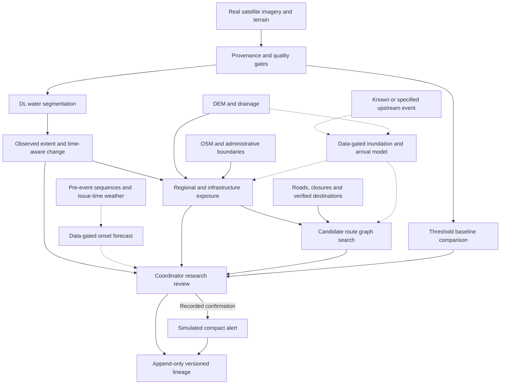
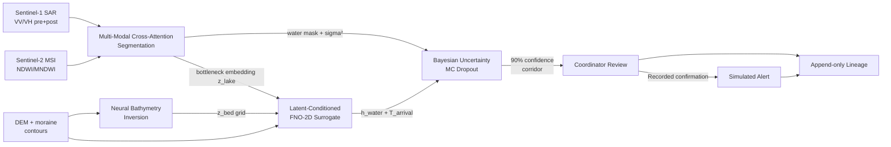

# SIREN

## Satellite-Informed Risk & Emergency Network

**Product Requirements Document**

| | |
|---|---|
| **Version** | 5.0 — End-to-end neural pipeline: latent-conditioned FNO coupling, neural bathymetry inversion, multi-modal sensor fusion, Bayesian uncertainty estimation. Supersedes v4.7 shadow-mode architecture. |
| **Target track** | Originally Track 7 — *Living with Uncertainties, Building with Resilience* (>.hack();'26); now an ongoing personal research project |
| **Track areas** | Area ii: Communication Systems During Disasters for Effective Response · Area iii: Curbing Diseases That Arise During Disasters |
| **Geography** | Existing Dudh Koshi / Imja demo; one research pilot basin and hazard type to be confirmed after forecasting-data feasibility review. South Lhonak is a candidate retrospective case, not proof of generalization. |
| **Origin** | >.hack();'26 hackathon MVP; now an ongoing portfolio-quality ML research application |
| **Status** | Active development — transition from hybrid shadow architecture to end-to-end differentiable neural pipeline. Deterministic baseline retained as labeled fallback and regression target; ML components promoted from shadow to primary analytical path per ADR-013. |

### Document authority and implementation status

This revision (v5.0) defines the architectural transition from a hybrid shadow system to an end-to-end differentiable neural pipeline, per ADR-013. The four-step blueprint (§9.7) eliminates the empirical and deterministic safety nets that constrained the v4.7 shadow architecture: the Huggel area-volume power law is replaced by neural bathymetry inversion (§9.7.1), single-modality SAR segmentation is replaced by multi-modal sensor fusion (§9.7.2), the scalar V_breach injection into the FNO is replaced by latent spatial conditioning from the segmentation bottleneck (§9.7.3), and hardcoded threshold gates are augmented by Bayesian epistemic uncertainty estimation (§9.7.4). The deterministic baseline (NDWI, SAR backscatter ratio, D8 corridor) remains as a labeled fallback and regression target, not as a co-equal analytical path.

Existing ADR safety gates (ADR-010, ADR-011, ADR-011.1, ADR-012), dependency approval requirements, and the frozen demo remain in force. This PRD is not an operational deployment approval and does not silently amend API contracts, scoring weights, or ADR-012's restrictions on flood-depth and arrival-time use. The human gate (Hard Rule 3) and explainability requirement (Hard Rule 5) are preserved through the transition.

The target is a **fully ML-driven research application**: a trained segmentation model supplies the primary analytical mask; a neural bathymetry estimator replaces empirical volume formulas; a latent-conditioned FNO surrogate connects segmentation directly to downstream flood dynamics without breaking gradient flow; and spatially-resolved uncertainty maps provide statistically rigorous safety bounds without hardcoded threshold fallbacks. Physical/geospatial analysis and graph routing turn the neural outputs into decision support. The deterministic baseline remains available for comparison and an explicitly labeled fallback. Forecasting and downstream arrival predictions remain separate, data-gated milestones.

Historical test counts, demo outputs, and completed checkboxes in older documents are not current verification evidence. Each milestone requires a dated evaluation with input/split manifests and model/processing versions. Current model limitations and invalidated results are recorded in §17.3.

---

## 1. Executive Summary

SIREN is a human-in-the-loop, satellite-assisted early-warning and disaster-response platform for vulnerable Himalayan basins. It fuses Synthetic Aperture Radar (SAR) and optical Earth-observation scenes with rainfall, terrain, river, population, and infrastructure data to model hazard progression and downstream exposure. The system surfaces evidence to an authorized emergency coordinator through an explainable review console and — only after human confirmation — dispatches a geofenced, bandwidth-light alert alongside a disease-prevention action sheet for affected water and health infrastructure.

The core problem is not that satellite data is unavailable — it is that **observations remain disconnected from operational response** under exactly the conditions that motivated this project: limited time, limited infrastructure, and severed communication. A change in a glacial lake, river corridor, or unstable slope has no operational value until a system converts it into an answer to four questions:

> **What is changing? Might flooding occur within a defined future window? Which regions and assets could be affected? Which candidate escape routes remain usable under the available evidence?**

```text
Real satellite observations + terrain + weather + infrastructure
                              ↓
              Provenance, alignment & quality gates
                              ↓
       DL water segmentation → observed extent / change history
                              ↓
   Exposure mapping ← observed extent / labeled downstream corridor
                              ↓
     Road/path graph + verified destinations + closure evidence
                              ↓
           Coordinator-reviewed candidate evacuation routes
                              ↓
        Human-confirmed simulated alert + append-only audit

Data-gated extensions (not yet validated):
Historical pre-event sequences → time-window flood-onset probability
Known/assumed upstream event + terrain → inundation / arrival estimates
```

SIREN does not predict the exact time of a glacial-lake outburst or issue autonomous evacuation orders. A future onset forecast estimates risk over a declared horizon using only information available at its issue time. A downstream arrival estimate is conditional on an observed or specified upstream event; it is not a prediction of breach onset. Neither an observed water mask nor a static corridor is a forecast. Outputs must expose uncertainty, missing evidence, and data age rather than imply guaranteed warning or escape.

---

## 2. Problem Statement & Scope Alignment

Mountain communities in the Himalayas face cascading hazards — extreme rainfall, flash floods, landslides, glacial-lake outburst floods (GLOFs), debris flows, road and bridge failures, and communication blackouts. The same event cascades through a chain of systems: a high-altitude lake or slope changes first, a river corridor becomes dangerous next, and downstream settlements, roads, bridges, hospitals, shelters, and water supplies are affected afterward.

Two operational failure modes compound this, and they map directly onto the project's two named focus areas:

**Area ii — Communication systems during disasters.** Ground networks collapse when roads, bridges, and cell towers are washed out by flash floods or GLOFs — often exactly when coordination matters most. SIREN's alert payload is designed for constrained links (compressed SMS, LoRa mesh, satellite messengers) so a verified warning can still travel when conventional infrastructure can't.

**Area iii — Disease prevention following disasters.** Waterborne disease is one of the largest secondary killers after flooding — contaminated wells, submerged sanitation, and severed clinic access. SIREN intersects the detected inundation polygon with municipal water points, wells, and health facilities to generate an immediate contamination-priority list, so water-purification and medical response can be dispatched within hours, not after outbreak onset.

**Area i — Personnel identification.** SIREN does not identify individuals in this scope. Settlement-level exposure, road/bridge access evidence, and candidate routing support responders without claiming to locate trapped people. Missing-persons registries, survivor identification, and family reunification remain outside the current roadmap and privacy scope (§13–§14).

Current disaster workflows are fragmented across satellite providers, weather services, terrain data, field reports, and alerting authorities — usually manually reconciled by an analyst under time pressure. Earth-observation imagery also has real constraints: optical sensors are blinded by monsoon cloud cover, satellite passes are periodic rather than continuous, and processing latency varies (Sentinel-1 NRT typically delivers 1–3 hours post-overpass). A responsible system must combine multiple evidence sources, expose its own uncertainty, and keep a human at the decision point before any public communication goes out.

### 2.1 Product problem statement

> Emergency coordinators need a faster, explainable, and weather-resilient way to turn new satellite and environmental observations into localized hazard assessments, downstream exposure maps, disease-risk flags, and verified alerts for communities and critical infrastructure in Himalayan basins.

### 2.2 Product hypothesis

If SIREN automatically compares new SAR/optical observations against a historical baseline, fuses the resulting change signal with weather, terrain, and infrastructure exposure, and routes the evidence through a human-review workflow, emergency teams can identify priority zones, verify warnings, and trigger disease-prevention response measurably faster than through manual, disconnected analysis — particularly during the cloud-covered monsoon windows when optical-only systems go blind.

---

## 3. Product Vision

> **SIREN turns changing conditions observed from space into understandable, location-specific action on the ground — even when the ground loses power, signal, and visibility.**

The platform is a decision-support layer connecting Earth observation, environmental intelligence, emergency operations, and community protection. Its architecture generalizes beyond one disaster type: flood expansion, glacial-lake monitoring, landslide indicators, river obstruction, infrastructure exposure, post-event damage assessment, and — per the project scope — the disease and communication response layers that follow a hazard event.

---

## 4. Users & Stakeholders

| User | Need | SIREN Value |
|---|---|---|
| Emergency coordinator | Decide fast whether a detected change requires action | Evidence panel, composite hazard score, explainable review workflow |
| Disaster-management authority | Identify exposed settlements and access routes | Geofenced exposure corridor with infrastructure tolerance buffers |
| Public health & water response team | Prevent outbreaks from flooded water/sanitation sources | Post-flood water-contamination priority map, disease action sheet |
| Search-and-rescue team | Know which roads, bridges, and corridors are compromised | Priority asset-failure layer, road-cut map |
| Field responder / community | Receive a clear, verified warning despite network loss | Compressed, geofenced alert deliverable over constrained links |
| Remote-sensing analyst | Inspect evidence and model confidence | Before/after rasters, change masks, metadata, provenance |

The primary MVP user is an **authorized emergency coordinator**. The public alert recipient experience is simulated for the demo and, in a real deployment, must be routed through an approved alerting authority.

---

## 5. Product Principles

1. **Evidence-led.** Every alert must show the observations and features that produced the assessment.
2. **Human-supervised.** The system prioritizes and recommends; a human confirms anything that leaves the system.
3. **Uncertainty-aware.** Cloud cover, missing data, misalignment, and low image quality reduce confidence — they are never silently treated as "safe."
4. **Weather-resilient.** Where optical sensing fails, SAR takes over automatically. Monsoon cloud cover is the expected case in the Himalayas, not the edge case.
5. **Operationally useful.** Output identifies specific communities, roads, bridges, clinics, shelters, and water points — never just a red polygon.
6. **Realistic about latency.** Satellite data is periodic/near-real-time (Sentinel-1 NRT typically 1–3 hours post-overpass), never framed as a live camera feed.

---

## 6. Core Product Workflow

The existing ingestion → detection → exposure → review → dispatch structure is retained. DL research inference replaces the primary research mask source (§6.3); forecasting and candidate routing extend the flow through §7.9–§7.12. The existing deterministic operational/demo path is not replaced by this document.

```text
[6.1 Ingestion] → [6.2 Quality gate] → [6.3 Detection / research DL]
                                                ↓
                               [6.4 Observed / corridor exposure]
                                                ↓
                   [7.9–7.11 Gated forecasts and candidate routes]
                                                ↓
                   [6.5 Scores / evidence] → [6.6 Human review]
                                                ↓
                               [6.7 Simulated dispatch + audit]
```

**6.1 Observation ingestion.** Pulls Sentinel-1 GRD SAR and Sentinel-2 L2A optical scenes via the Copernicus Data Space Ecosystem (STAC API), plus NASA GPM IMERG rainfall and Open-Meteo forecast context. Every observation records source, acquisition time, processing time, spatial footprint, and quality metadata.

**6.2 Preprocessing, co-registration, and quality gate.** Scenes are clipped to the basin boundary, reprojected onto the SRTM baseline grid, and checked for cloud cover, missing pixels, and alignment error. If optical cloud fraction exceeds ~20%, the pipeline automatically promotes Sentinel-1 SAR to the primary change-detection path — SAR backscatter is unaffected by cloud or darkness. The gate outputs a usability verdict and a confidence multiplier, never a silent pass.

**6.3 DL-led detection (research target).**
- Train a compact PyTorch U-Net/ResUNet on real SAR imagery and water labels. Research mode uses its georeferenced water mask for measured area and exposure analysis, with checkpoint and input provenance visible. It must not masquerade as the approved operational path.
- Segment each acquisition independently and difference compatible masks for observed change. Compare SAR-only and terrain-aware models where real co-registered DEM coverage exists; add paired-image models only after the paired dataset's channel semantics, label target, registration, and event splits are verified.
- Retain SAR thresholds and optical NDWI as explicit comparison baselines and labeled fallbacks, not hidden replacements for failed ML inference. Optical imagery remains useful for quality-controlled cross-checks.
- Water segmentation does not establish debris, moraine movement, or future flooding. Additional semantic classes require defensible labels. Synthetic temporal channels, fabricated terrain, and target-derived inputs are prohibited.

**6.4 Temporal trend, hydrological corridor, and exposure mapping.** Two-to-four observations are compared chronologically; persistence across multiple passes is required before escalation (stable / slowly expanding / rapidly expanding / uncertain — never a precise collapse time). The downstream exposure corridor uses a **combined D8 + OSM river buffering** approach (ADR-005 / Roadmap Phase 3):

1. **D8 reachability (physical validation):** SRTM-derived D8 flow accumulation traces the downstream flow path from the change polygon centroid, confirming the change source drains into the expected sub-basin (e.g., Imja lake → Imja Khola / Dudh Koshi) rather than an adjacent drainage divide.
2. **OSM river selection:** waterway segments (`waterway=river/stream`) reachable by the D8 path are selected — these capture the real, surveyed riverbed through inhabited valleys, which a single-pixel D8 path at 30 m resolution can miss in steep terrain (drainage-trenching artifacts, lateral moraine walls).
3. **Floodplain buffer:** the reachable river segments are buffered by a nominal flood-plain width (100–150 m).
4. **Exposure intersection:** the buffered corridor is intersected against OSM-sourced settlements, roads, bridges, hospitals, shelters, water points, and food facilities using resolution-aware tolerance buffers (bridges ±75 m, roads ±50 m, settlements/wells ±100 m) to avoid false intersections at 10–30 m satellite resolution.

**6.5 Risk fusion and disease-risk scoring.** Satellite change, temporal trend, rainfall, terrain, hydrology, and exposure combine into a hazard score, exposure priority, and a waterborne-disease risk index (§9.5). A policy engine classifies the result as informational, watch, elevated, or eligible for critical human review.

**6.6 Human-in-the-loop review.** The coordinator sees an interactive card: before/after rasters, the change overlay, hazard and confidence scores, the affected-asset list, the disease action sheet, and a decision control — **Confirm**, **Reject**, or **Postpone / Request local verification**.

**6.7 Resilient dispatch and audit.** A confirmed alert is compressed into a low-bandwidth payload and dispatched in simulation mode to a geofenced recipient set (SMS / push / LoRa-mesh / satellite-messenger format). Every run, model version, input snapshot, reviewer decision, and dispatch action is written to an append-only audit log.

---

## 7. Functional Requirements

**7.1 Monitoring and data management.** Authorized users configure a basin boundary, monitoring layers, and alert recipients; the system supports a baseline observation plus a sequence of subsequent observations, each retaining source, date, spatial reference, quality metadata, and processing status.

**7.2 Multi-sensor ingestion and preprocessing.** Ingest Sentinel-1 (IW, GRD) and Sentinel-2 (L2A) via STAC APIs; clip to basin polygon, project to WGS 84/UTM, extract backscatter and spectral values; maintain an offline-resilient local GeoTIFF/COG cache for demo reliability without live network dependency.

**7.3 Change detection and risk assessment.** Align observations to a common grid, calculate a water/change mask and change statistics, and expose both original and processed layers on the map. Calculate a transparent hazard score and separate exposure-priority score, always paired with the evidence and confidence behind it.

**7.4 GIS corridor and exposure mapping.** Compute downstream flowlines from the change polygon via terrain slope; query OSM/Overpass layers for critical facilities (settlements, roads, bridges, hospitals, shelters, water points, food facilities) inside or near the corridor.

**7.5 Disease-prevention action layer.** Detect submerged or encircled water points, storage tanks, and clinics; auto-generate a Disease Prevention Action Sheet (e.g., water purification dispatch, boil-water advisory) targeted to the affected geofenced zone.

**7.6 Human review.** Create a review card for elevated/critical results showing the image timeline, change overlay, hazard and confidence scores, affected assets, disease flags, recommended actions, and a decision control.

**7.7 Resilient alerting.** Support simulated geofenced dispatch over SMS/push and a compressed (<250 byte) payload format suitable for LoRa mesh or satellite messengers; log recipient groups, message content, status, timestamp, and alert zone. Real public alerting requires authenticated authority approval and an approved channel integration.

**7.8 Auditability.** Preserve every run, model version, input snapshot, risk result, reviewer decision, and alert action so a later user can reconstruct why an alert was created and how it was handled.

**7.9 Forecasting readiness and onset forecasts (data-gated).** Select one pilot basin, hazard type, event definition, and prediction horizon after inspecting historical coverage. Train only on predictors available at issue time, with verified event and non-event periods. Report an explicit unavailable/insufficient-data outcome when coverage or freshness is inadequate. A susceptibility score without a time horizon is not an onset forecast. GLOFs and rainfall-driven river floods must not share unsupported labels or evaluation claims.

**7.10 Impact and regional exposure.** Distinguish observed inundation, potential downstream exposure from a static corridor, and any future forecast/scenario inundation. Intersect each with versioned administrative boundaries, settlements, population, roads, bridges, and essential facilities; record the evidence type for every affected-area count. Include partially covered regions and missing population data explicitly; never substitute a demo population default in research results. Predicted depth and arrival require separate held-out validation and uncertainty, not just segmentation IoU.

**7.11 Candidate evacuation routes (planned research capability).** Build a connected road/path graph with travel-mode restrictions, bridge connectivity, terrain, and timestamped closure evidence. Route from coordinator-selected settlement/access points to verified suitable destinations with recorded access and capacity information. Exclude known impassable or inundated edges, treat uncertain/stale edges explicitly, and never equate unmapped flooding with safety. Prefer graph search over unnecessary learned routing. Report route geometry, destination, estimated travel time, assumptions, and unavailable alternatives. Return “no verified route available” for disconnected or insufficiently verified networks. Arrival-aware routing is deferred until flood-arrival estimates are validated; it must compare travel time along the route plus a safety margin against flood arrival at each relevant segment, not only at the destination. All recommendations require coordinator review and are not guaranteed safe escape paths.

**7.12 Research/operational separation.** Display run mode and output provenance in the API, map, review card, and audit. Research inference must not modify the frozen operational dispatch path or automatically promote a checkpoint when a numeric metric is exceeded. Missing weights, incompatible channels, missing pairs, and absent terrain cause typed errors or an explicitly requested/labeled baseline fallback. Research and demonstration outputs cannot silently appear as live public warnings.

---

## 8. Recommended Stack (implementation guidance)

Reuse the existing local-first stack for a reproducible single-basin ML research app. PyTorch is central to research inference; the existing baseline can still run without it. PostGIS, Redis, cloud orchestration, and additional dependencies are not prerequisites for this milestone; additions remain subject to project approval.

| Layer | Choice | Rationale |
|---|---|---|
| Pipeline / backend | Python 3.11+, FastAPI | Geospatial ecosystem (rasterio, geopandas, xarray) is unmatched; FastAPI gives typed endpoints for free |
| Raster ops | rasterio, numpy, xarray | COG read/write, reprojection, NDWI/backscatter math |
| Hydrology (D8) | pysheds with existing NumPy compatibility handling | Physical drainage context; explicit OSM corridor fallback where appropriate |
| Vector ops | geopandas + shapely | Buffer/intersect against OSM layers |
| Database | SQLite (JSON columns) + GeoJSON files on disk | Zero-ops, offline-safe; PostGIS is the V2 migration path |
| Frontend | React + Vite + TypeScript | Fast scaffolding, typed API contracts |
| Map | MapLibre GL JS | Free, no token, raster+vector overlays, swipe-compare support |
| State/data | TanStack Query | Polling for pipeline run status |
| Deep learning | PyTorch U-Net/ResUNet; paired-image architecture after dataset qualification | Train and evaluate a focused water/flood model; never assume existing checkpoints are qualified |
| Routing | Road/path graph search with geospatial constraints | Candidate routes based on closures, access, and verified destinations; library choice subject to approval |

**Key tradeoff:** SQLite over PostGIS sacrifices spatial indexing for zero setup time. All spatial joins run in-memory via geopandas on a small basin extract (<100 MB), so this is safe at single-basin scale.

---

## 9. Hybrid AI & Computational Architecture

SIREN is a hybrid pipeline — deterministic physical modeling plus deep-learning vision — deliberately avoiding a single black-box model so every score stays explainable.

The diagram below is the target research architecture, not a claim of completed wiring. Dashed paths are data-gated extensions; operational promotion remains subject to ADR acceptance.



### 9.1 Quality gate

```json
{
  "quality_score": 0.88,
  "cloud_fraction": 0.11,
  "alignment_ok": true,
  "usable": true,
  "confidence_adjustment": 0.95
}
```

Confidence multiplier = (1.0 − cloud_fraction) × sensor-freshness weight. For a cloud-blocked optical scene, the gate routes to SAR and sets `cloud_fraction: 0.0` for that path — SAR is treated as all-weather capable.

### 9.2 Change detection & segmentation

**Implemented (MVP):** registered raster differencing plus NDWI (optical, `detect/ndwi.py`) and SAR backscatter log-ratio thresholding with multi-look speckle suppression and DEM slope masking (`detect/sar.py`). Scenario masks (`detect/scenario.py`) provide deterministic, reproducible demo masks near the Imja lake when the available SAR swath doesn't cover the change source.

**Historical audit (2026-09-07, not current qualification):** the post-build `ml/` layer contained a Siamese U-Net (ResNet-34 encoder) trained on synthetic bi-temporal Sen1Floods11 pairs, a five-class changed-crop classifier internally named "SegFormer" (not the SegFormer architecture), and a ConvLSTM trend classifier trained on synthetic water-mask progressions. The audit found train/inference input mismatches, threshold-generated labels, no held-out evaluation, and integration paths that can suppress rule-based evidence. No existing checkpoint is qualified for live hazard assessment — see `docs/reference/DL_MODEL_AUDIT.md`.

**Next implementation:** establish a reproducible U-Net/ResUNet baseline using real calibrated Sen1Floods11 VV/VH and original labels. Compare SAR-only against terrain-aware input where co-registration and coverage are valid. Use separate dataset adapters with explicit normalization and target semantics; water extent and new-flood/change labels are not interchangeable. Compare early-fusion and shared-encoder paired models only after S1GFloods qualification (§11.1). A missing pre-event image must fail closed, never invoke label-derived differences. Six channels are not mandatory; the available measurements determine the contract.

**Inference acceptance:** the selected checkpoint must load through the same preprocessing contract used during evaluation. Research-mode area and exposure results must derive from the model mask, not a hidden scenario mask; show the baseline separately. Probability maps must not be described as calibrated uncertainty unless calibration is evaluated. Permanent water, radar shadow, snow/ice, dry soil, empty-water chips, and invalid pixels require explicit error analysis. General flood-benchmark scores do not establish Himalayan GLOF warning performance.

### 9.3 Temporal trend and flood-onset forecasting

**Existing baseline:** retain deterministic `stable | slowly | rapidly | uncertain` trend classification. The archived synthetic ConvLSTM is not qualified. Use observation timestamps, elapsed time, minimum coverage, and data-age checks for measured area trends; missing timesteps remain missing.

**Forecast target (data-gated):** estimate the probability of a defined event within a declared horizon from issue-time information. Before choosing a temporal architecture, specify the basin/hazard, target, horizon, event/non-event sampling, observation cadence, missingness policy, and sources of event timing. Require adequate real pre-event histories across independent events and seasons; the earlier ≥2-season prerequisite alone is not evidence of sufficiency. Include rainfall and lake-level/river-gauge series when available. Archived weather forecasts must retain their issue times; future observed weather or retrospective reanalysis unavailable at issue time cannot be used as live forecast predictors.

Compare persistence/climatology and a compact statistical or ML baseline with a temporal DL model only when sequence coverage supports it. Fit normalization, feature selection, and calibration on training/validation data only. Hold out time periods and events/locations, evaluate useful lead time after acquisition/processing delays, and report false alarms, missed events, precision-recall, and probability calibration. Until this gate is feasible, show trends and “forecast unavailable,” not a fabricated breach probability or countdown. GLOF onset and rainfall-driven river flooding require separate target definitions and evidence.

### 9.4 GIS exposure engine

Deterministic spatial analysis (not learned) for MVP transparency and easy validation. The engine combines two evidence sources (see §6.4):

- **D8 flow accumulation** validates the gravity gradient — that floodwater from the change source drains into the expected sub-basin.
- **OSM river buffering** captures the real surveyed riverbed through inhabited valleys, which a raw D8 path can miss at 30 m resolution in steep Himalayan terrain.

The engine intersects the buffered corridor with terrain and asset layers using the tolerance buffers in §6.4. Research mode additionally intersects the georeferenced DL mask with assets and administrative boundaries. Keep observed-mask exposure separate from potential corridor exposure; neither proves that an unobserved road is passable. Graph-based evacuation support follows §7.11 and does not require a graph neural network.

**Future impact/arrival model:** estimate inundation and downstream arrival conditional on specified upstream conditions and terrain. Require real georeferenced inundation labels and independently sourced timing/depth/discharge evidence, with consistent event origin, units, dates, and measurement uncertainty. Do not derive “observed” travel times from an assumed speed or adjust speed limits against the final validation events. Static buffers and current FNO demonstrations are not validated hydraulic forecasts. Under the current no-synthetic-data scope, do not create synthetic terrain or simulated hydrodynamic training targets; any future physics-simulation training proposal requires explicit approval and separate provenance. Flood-arrival and depth use for evacuation prioritization remains subject to ADR-012 and a future accepted ADR.

### 9.5 Risk-fusion and disease scoring

**Implemented** in `backend/siren/risk/fusion.py`. Every score carries a deterministic `reasons` array (≥3 entries on elevated+ — Hard Rule 5).

**Hazard score:**

```text
H = 0.30 × satellite-change trend (S_trend)
  + 0.25 × water-area expansion (A_expansion)
  + 0.20 × rainfall / snowmelt indicator (R_rain, 24h + 7d)
  + 0.15 × terrain and slope risk (T_slope)
  + 0.10 × downstream proximity (D_prox)
```

> **Current baseline:** retain the five-factor formula above. Model confidence is not a physical hazard factor and the score is not a calibrated event probability. A future learned forecast is a separate, time-defined output until a validated comparison and accepted contract/scoring amendment justify integration. This PRD does not select arbitrary sixth-factor weights or qualify the current XGBoost checkpoint.

**Exposure priority:**

```text
E = H × Population Vulnerability × Critical Infrastructure Weight
```

**Waterborne disease risk index:**

```text
D_risk = Inundated Water Points × Population Density × Temperature Index
```

`D_risk` flags zones for immediate water-purification and medical-supply dispatch — it is explicitly a triage priority signal, not a medical diagnosis.

Initial deployment uses explainable weighted scoring. Historical event labels alone do not qualify a susceptibility model: real feature measurements, an appropriate population at risk, non-event follow-up, spatial/temporal separation, and held-out calibration are required. HMAGLOFDB is an event inventory, not a complete supervised feature/control table. Unmatched inventory lakes cannot automatically be labeled stable. Every score displayed to a coordinator is accompanied by reasons, never a bare number.

### 9.6 Explanation layer

Deterministic templates generate evidence summaries for safety-critical output. An optional LLM may rephrase structured evidence but must be schema-constrained: it receives only the validated risk object and may not invent measurements, locations, or confidence values.

### 9.7 End-to-End Neural Pipeline (v5.0 — ADR-013)

The v4.7 shadow architecture retained four non-neural safety nets that constrain the system to a hybrid posture: (1) the Huggel et al. (2002) empirical area-volume power law for breach volume when the DEM lacks bathymetric resolution, (2) single-modality SAR segmentation capped at ~0.62 IoU by terrain layover and speckle, (3) a scalar V_breach injection into the FNO that breaks gradient flow between segmentation and hydrodynamics, and (4) hardcoded severity thresholds with no epistemic uncertainty quantification. The v5.0 pipeline eliminates each bottleneck with a corresponding neural component, creating a differentiable path from raw radar bytes to downstream flood dynamics.



**Structural comparison:**

| Pipeline component | v4.7 hybrid shadow | v5.0 end-to-end neural |
|---|---|---|
| Water delineation | SAR 6-channel WaterResUNet (~0.62 IoU) | Multi-modal SAR + optical cross-attention transformer (>0.80 IoU target) |
| Basin bathymetry | Huggel empirical power law (V = 0.104 · A^1.421) | Neural glacial bed inversion (INR / physics-informed) |
| Hydraulic coupling | Scalar V_breach injection (log(1+V)/20) into FNO | Latent spatial conditioning from segmentation bottleneck → FNO lifting layer |
| Safety & validation | Human gate + rule-based shadow checks | Spatial evidential uncertainty + conformal risk bounds + human gate |

#### 9.7.1 Neural Bathymetry Inversion (replaces Huggel formula)

**Problem:** the Huggel et al. (2002) power law V = 0.104 · A^1.421 is a 24-year-old empirical scalar approximation. When the DEM is a surface model (DSM, e.g. SRTM over water), it returns the flat water surface as the "bed," producing zero or noise-level bathymetric signal. The current `auto` fallback to Huggel is a lossy scalar that discards all spatial structure of the lake basin.

**Neural solution:** train a physics-informed neural network (PINN) or implicit neural representation (INR) to reconstruct the submerged lake bed topography z_bed(x, y) from surrounding sub-aerial moraine DEM contours, lake boundary shape features, and glacier terminus velocity fields.

- **Input:** moraine DEM contours (z_rim), lake boundary polygon, glacier terminus velocity (if available from feature tracking).
- **Mechanism:** glacial lake beds are carved by ice dynamics. A small U-Net or graph neural network trained on glacial bed inversion datasets (Millan et al. 2022 consensus ice thickness, Farinotti et al. 2019) predicts the submerged bed elevation map ẑ_bed(x, y).
- **Output:** V_breach = Σ max(0, z_surface − ẑ_bed(x, y)) · pixel_area — a neural prediction rather than an empirical scalar.
- **Fallback:** the Huggel formula is retained as a labeled empirical fallback for basins outside the training distribution, with provenance recording the method used. The `auto` mode in `breach_volume.py` is extended: neural bathymetry → Huggel fallback → strict hypsometric (if DEM resolves bathymetry).
- **Gate:** the neural bathymetry model must achieve < 15% MAPE on held-out lakes with known bathymetry (from Millan/Farinotti consensus estimates or surveyed lakes). Until this gate passes, the Huggel fallback remains the primary path.

#### 9.7.2 Multi-Modal Sensor Fusion (replaces single-modality SAR)

**Problem:** the 6-channel SAR-only WaterResUNet saturates at ~0.62 IoU because single-frequency C-band radar suffers from terrain layover, shadow, and speckle noise in steep Himalayan terrain.

**Neural solution:** implement multi-modal cross-attention fusion of dual-pol Sentinel-1 SAR (all-weather) with cloud-masked Sentinel-2 multispectral imagery (NDWI, MNDWI bands).

- **Architecture:** a lightweight cross-attention transformer (SegFormer-style or Swin backbone) where SAR features query optical features when cloud cover is low, and smoothly rely on SAR priors when clouds are detected.
- **Input contract:** SAR channels (VV_post, VH_post, VV_pre, VH_pre, ΔVV, ΔVH) + optical channels (NDWI, MNDWI, cloud mask) when available. The fusion layer handles variable optical availability via a cloud-gated attention mask.
- **Target:** push segmentation IoU beyond 0.80 across steep terrains, addressing the ~0.70 recall ceiling.
- **Gate:** event-held-out IoU > 0.75 AND precision ≥ 0.85 on real paired SAR+optical data. Until this gate passes, the SAR-only 6-channel model (ADR-011.1 gate-passed, IoU 0.62) remains the primary segmenter.

#### 9.7.3 Latent Spatial Conditioning (replaces scalar V_breach injection)

**Problem:** the current pipeline transitions from neural segmentation → discrete pixel counting → scalar V_breach → neural FNO surrogate. This breaks gradient flow and treats the FNO as a detached stage. The FNO receives only a 1D scalar (log(1+V_breach)/20) that discards all spatial structure of the lake basin.

**Neural solution:** continuous latent conditioning. Instead of converting the segmented lake mask into a discrete scalar volume, extract the latent feature embedding z_lake ∈ R^(C × H/16 × W/16) from the bottleneck of the segmentation network and feed it directly into the FNO's lifting layer alongside the normalized DEM.

- **Formula:** h_0(x, y) = P(DEM(x, y), W(z_lake)) where P is the FNO lifting projection and W is a learned projection from the segmentation bottleneck to the FNO input width.
- **Mechanism:** the FNO learns to condition downstream hydrodynamics directly on lake basin geometry, shoreline steepness, and moraine outlet width — all encoded in the spatial latent — rather than relying on a 1D scalar volume input.
- **Implementation:** `FNO2D` input contract changes from (B, 2, H, W) [DEM + V_breach] to (B, 2 + d_latent, H, W) [DEM + projected z_lake]. The segmentation bottleneck is spatially upsampled to match the FNO grid. The scalar V_breach path is retained as a labeled fallback channel.
- **Gate:** the latent-conditioned FNO must achieve ADR-012's MAPE ≤ 20% on at least two of three validation events (South Lhonak, Chamoli, Dig Tsho) with no evaluated point > 30%. The scalar-injection FNO remains as a labeled fallback until this gate passes.

#### 9.7.4 Bayesian Neural Uncertainty (augments hardcoded thresholds)

**Problem:** shadow systems are retained because teams do not trust neural networks to reliably detect their own out-of-distribution (OOD) errors in life-critical scenarios. Hardcoded severity thresholds (expansion ≥ 40% → critical, etc.) provide no measure of confidence in the prediction itself.

**Neural solution:** conformal prediction and epistemic uncertainty estimation.

- **Mechanism:** add Monte Carlo Dropout or Deep Evidential Regression to WaterResUNet. At inference, run T forward passes with dropout active (MC Dropout) or interpret the evidential output distribution (Deep Evidential Regression).
- **Output:** a spatially resolved uncertainty map σ²(x, y) alongside the water mask. The uncertainty map identifies regions where the model is uncertain (OOD terrain, cloud-affected pixels, unusual lake shapes).
- **Safety:** when showing predictions to evaluators or operators, display a statistically rigorous, distribution-free 90% confidence corridor on the downstream flood wave arrival time, not just a binary flood boundary. This demonstrates how modern ML systems handle safety without hardcoded heuristic rules.
- **Conformal calibration:** calibrate the uncertainty estimates on a held-out calibration set using split conformal prediction to guarantee distribution-free coverage of the 90% confidence interval.
- **Gate:** the uncertainty-calibrated predictions must achieve empirical coverage within ±5% of the nominal 90% level on a held-out calibration set. Until this gate passes, uncertainty maps are displayed as informational only, not as calibrated safety bounds.

---

## 10. Data Pipeline & Contracts

### 10.1 Target research pipeline steps

```text
 1. Select approved pilot basin, hazard type, run mode, and time range
 2. Ingest approved AOI subsets or load pinned local inputs
 3. Validate provenance, timestamps, channel semantics, and spatial metadata
 4. Calibrate/clip/reproject/align; apply quality and invalid-pixel masks
 5. Load the declared checkpoint and matching preprocessing contract
 6. Run DL water segmentation and the separate comparison baseline
 7. Measure observed water area and time-aware change on compatible grids
 8. Join available weather, terrain, boundaries, and infrastructure
 9. If qualified, issue a time-window onset forecast; otherwise mark unavailable
10. Separate observed inundation, corridor exposure, and qualified impact forecasts
11. Compute regional/asset exposure with provenance and missing-data status
12. Generate candidate routes using verified destinations and edge constraints
13. Present baseline scores, ML evidence, limitations, and route alternatives
14. Apply data freshness, research-mode, and human-review gates
15. Record confirm, reject, or postpone against the exact run version
16. Simulate the compact alert only after recorded confirmation
17. Preserve input, checkpoint, processing, graph, and review lineage
```

Steps 9 and forecast-dependent parts of steps 10–12 are gated milestones, not mandatory fabricated outputs. The legacy deterministic offline demo remains independently runnable. New research endpoints must remain thin and delegate to domain modules.

### 10.2 Observation data contract

```json
{
  "observation_id": "obs-003",
  "basin_id": "dudh-koshi-demo-01",
  "acquired_at": "2026-08-12T12:00:00Z",
  "source": "sentinel-1-grd-nrt",
  "raster_uri": "data/processed/obs-003.tif",
  "crs": "EPSG:4326",
  "quality_score": 0.88,
  "cloud_fraction": 0.0,
  "optical_cloud_fraction": 0.90,
  "alignment_ok": true,
  "usable": true,
  "confidence_adjustment": 0.95,
  "water_area_km2": 4.3,
  "water_area_change_percent": 43.0,
  "rainfall_24h_mm": 60.0,
  "rainfall_7d_mm": 160.0,
  "mean_slope_degrees": 31.0,
  "processing_version": "0.1.0",
  "status": "processed"
}
```

### 10.3 Alert data contract

```json
{
  "alert_id": "alert-0091",
  "geofence_id": "sector-b",
  "severity": "HIGH",
  "hazard_type": "possible_flood_or_debris_flow",
  "confidence": 0.76,
  "exposed_population": 1248,
  "critical_assets": ["bridge-12", "road-4", "village-2"],
  "disease_flags": ["well-3-submerged", "well-7-encircled"],
  "recommended_action": "Verify locally and prepare downstream warning",
  "human_review_required": true
}
```

### 10.4 Resilient compressed payload

Confirmed alerts serialize to <250 bytes for LoRa mesh / satellite messenger / low-bandwidth SMS:

```json
{"aid":"siren-04","sec":"B","haz":"GLOF_FL","lvl":3,"exp_pop":1240,"crit":["BR-12","RD-4"],"med_act":"BOIL_WATER_NOW"}
```

The public-facing message avoids false certainty:

> **Potential flood or debris-flow risk detected in Sector B. Follow instructions from local authorities, avoid the downstream river corridor, and move toward the designated shelter if instructed.**

---

### 10.5 Planned research result contracts

The existing §9.1 and §10.2–10.4 field names and payload contract remain unchanged. Before implementing research APIs, define and test versioned schemas for the following records; this table specifies required information, not already implemented JSON fields or endpoint names.

| Record | Required information |
|---|---|
| Research run | Mode, run/observation/basin IDs, issue time, input availability cutoff, processing version, input/checkpoint hashes, spatial footprint, quality, reasons and unavailable-data status |
| Segmentation | Target semantics, channel/normalization contract, model version, georeferenced mask/probability asset references, nodata/coverage, area units, separately identified baseline output |
| Onset forecast | Hazard/event definition, forecast issue time, horizon start/end, calibrated probability when qualified, supporting observation times, uncertainty method, validity/expiry and unavailable reason |
| Impact layer | Observed/corridor/forecast/scenario evidence type, origin time and upstream assumptions where applicable, depth/time units, geometry/CRS, affected region/asset IDs, source dates and uncertainty |
| Candidate route | Origin, verified destination and verification date, graph/closure versions, travel mode, route geometry and edge IDs, estimated travel time, excluded edges, evidence age, assumptions, alternatives and no-route reason; conditional arrival margins only when qualified |

Keep full route geometries and detailed evidence in the app/audit, not the compact radio payload. Any payload extension requires explicit schema review and byte-limit tests. A review must bind to an immutable result version; changed evidence or routes require a new review. Research output unavailable does not mean risk is zero.

---

## 11. Dataset Plan

| Dataset | Type / Source | Role in SIREN | Storage |
|---|---|---|---|
| Sentinel-1 C-SAR | Copernicus CDSE, 10 m GRD | All-weather backscatter differencing for water/debris tracking | GeoTIFF/COG + metadata |
| Sentinel-2 MSI | Copernicus CDSE, 10–20 m multispectral | Quality-controlled optical NDWI and visual cross-checks; learned optical models deferred | GeoTIFF/COG + metadata |
| SRTM 1 Arc-Second | NASA Earthdata, 30 m DEM | Elevation, slope angle, D8 downstream hydrological flow | Raster DEM |
| GPM IMERG | NASA GES DISC, 0.1° NRT | Basin-wide antecedent rainfall and storm-intensity metrics | NetCDF/GeoTIFF/feature table |
| Open-Meteo | HTTP API | Development weather and soil-moisture context | JSON time series |
| OpenStreetMap (HOT) | Humanitarian OSM Team vectors | Roads, bridges, clinics, schools, and municipal water sources | GeoJSON/GeoPackage |
| Sen1Floods11 | Public benchmark dataset | Pretraining/benchmarking SAR flood-water segmentation weights | GeoTIFF/COG |
| ICIMOD inventories | Open data/reports | Glacial-lake baselines and regional GLOF context | GeoJSON/GeoPackage |
| WorldFloods v2 | S2 L1C + curated flood/cloud masks, 509 events 2016–23 (HuggingFace `isp-uv-es/WorldFloodsv2`; masks on Zenodo) | Cloud-aware optical flood segmentation training/validation (ADR-010 Stage 1b) | **CC non-commercial — license review required** |
| JRC Global Surface Water | Monthly water history 1984–present + permanent-water layer (GEE `JRC/GSW1_4`) | Permanent-water prior; persistent-vs-new-water separation | GEE raster |
| DynamicWorld V1 | NRT 10 m S2 LULC class probabilities — water, flooded_vegetation, snow_and_ice (GEE `GOOGLE/DYNAMICWORLD/V1`) | Opportunistic optical cross-check; weak-supervision candidate | GEE raster |
| Copernicus DEM GLO-30 | 30 m global DEM (Copernicus Data Space) | Alternative/successor to SRTM for slope + D8 (per-basin requalification required, ADR-005) | Raster DEM |
| HydroLAKES / GLIMS-RGI | Global lake extents / glacier outlines | Lake identity, naming, historical extents for baselines and reporting | GeoJSON/GeoPackage |
| SSL4EO-S12 | Self-supervised S1/S2 encoders (ResNet/ViT; MoCo/DINO/MAE) | Optional encoder initialization for the Stage-1 SAR segmenter (ADR-010) | PyTorch checkpoints |

### 11.1 Immediate local-data plan

| Source | Verified or known limitation | Next action |
|---|---|---|
| Sen1Floods11 | Real georeferenced SAR and water labels available locally | Validate manifests, units, label/nodata handling and event-separated splits; train the first segmentation baseline |
| S1GFloods | Local archive integrity check passed; 5,360 A/B/Label triplets extracted (16,080 files, approximately 868 MB uncompressed). Inspected A/B samples are three-channel uint8 256×256 PNGs without embedded georeferencing | Verify A/B acquisition order, channel encoding, label meaning, licensing, event/location IDs, and original split policy before using a dedicated adapter. PNG channels are not assumed to be calibrated VV/VH. Do not supply this directory to the Sen1Floods11 `pre_sar_dir` interface |
| Cached Copernicus GLO-30 / SRTM | Terrain exists locally; coverage is chip/basin dependent | Check spatial coverage, nodata, scale, and co-registration before computing slope/HAND. Do not fabricate terrain for ungeoreferenced PNGs |
| HMAGLOFDB + lake inventories | Real event and lake records; incomplete measured susceptibility features and no automatic verified negative labels | Preserve event provenance; audit pre-event feature availability and monitored non-event periods. Do not manufacture dam geometry, rainfall, expansion, or negative outcomes |
| Local satellite scenes and OSM | Useful for an inference case study, not automatically labeled evaluation data | Verify footprints, pre/post acquisition order, orbit compatibility, asset dates, and overlap for the chosen basin |

A paired benchmark with unrecoverable event/location grouping cannot support a claim of event-held-out generalization. It may remain exploratory, explicitly labeled, or be excluded from the final benchmark. Do not attach geographically specific exposure results to images without a validated spatial mapping.

### 11.2 Additional evidence needed for forecasting and routing

- Onset forecasting: timestamped pre-event histories, verified event definitions/times, monitored non-event periods, rainfall/gauge/lake-level coverage, and archived forecast issue times where forecasts are used. Segmentation benchmarks alone are insufficient.
- Impact/arrival evaluation: observed inundation extents and independently documented timing/depth/discharge with citations and measurement uncertainty. Do not substitute assumed-speed calculations for observations.
- Regional exposure: versioned administrative boundaries, population coverage, and infrastructure attributes with source dates; overlapping/partial regions must not double-count exposure.
- Routes: connected roads and paths, bridge connectivity, mode/access restrictions, timestamped closures/field verification, and suitable destination locations with access/capacity status. OSM presence alone does not prove present-day passability or shelter suitability.
- Record missing evidence as a blocker with alternatives. Pilot basin, hazard type, forecast horizon, route travel mode, and destination policy require user/domain review before locking their implementation.

### 11.3 Bandwidth, storage, and provenance policy

Use existing local observations first. Full Kuro Siwo (~164 GB) and FloodPlanet downloads are **not prerequisites**. No bulk downloads or automatic restarts: the user controls acquisitions. Any approved additional acquisition should be bounded by basin, dates, bands, resolution, and a stated transfer/cache budget.

Prefer remote COG window reads or provider-side AOI processing when supported and authorized; verify authentication, quotas, format, and actual transfer volume. Dataset streaming transfers samples as consumed and may repeat transfers each epoch; it is not zero-bandwidth access and archive layout can prevent efficient random reads. Cache a reproducible working subset for offline inference, with source/product IDs, acquisition and availability times, CRS/units, preprocessing, licenses, checksums, and split membership. Connected ingestion remains separate from offline execution.

**Real-data-only requirement:** no generated temporal SAR, randomized environmental features, synthetic negative labels, invented event times, or synthetic/simulated hydrodynamic training targets in the research training/evaluation datasets. Missing measurements remain missing or the sample/task is rejected. Any justified statistical missing-data handling must be training-only, documented, and must not be presented as observed data. Existing isolated software-test fixtures may remain; they cannot count as scientific validation or feed research inference. Demo/scenario artifacts remain visibly separate from observations.

Record OSM extraction date and label source, annotator, date, class schema, and confidence. Split by event/location before training; related or overlapping chips must stay together. Once a test set informs architecture or tuning, treat it as development data and reserve an untouched final evaluation. Older dataset plans in `docs/reference/PRODUCTION_ML_PLAN.md` are background; this section governs the immediate resource-constrained scope.

---

## 12. User Interface Requirements

Reuse the existing Map, Timeline, Review, Audit, and Models views and the design conventions in `docs/design/UI_DESIGN.md`. Extend them rather than building a second console.

1. **Monitoring map.** Toggle source imagery, DL mask/probabilities, baseline mask, observed change, static corridor, and qualified forecast/scenario layers separately. Show affected administrative regions/assets and candidate routes with destination, mode, closure evidence, and no-route status. Probability colors must not imply calibrated confidence without validation.
2. **Observation timeline.** Show acquisition, data availability, processing, and forecast issue times distinctly. Display water-area history with elapsed time and gaps. Forecast horizon and upstream-event-relative arrival are different concepts and must not share an ambiguous countdown.
3. **Review panel.** Show mode, source freshness, model status, severity/baseline scores, exposure evidence, route limitations, minimum three reasons on elevated/critical results, and Confirm / Reject / Postpone controls. Unsupported forecasting/routing capabilities show unavailable states, not mock results.
4. **Audit & dispatch panel.** Preserve input, checkpoint, preprocessing, graph/closure versions, reviewer, and simulated delivery lineage. Show payload size ≤250 bytes. Changed results require renewed review.
5. **Models view.** Present measured experiments, split definitions, per-event metrics, baselines/ablations, latency, and failure cases. Invalidated checkpoints show disqualified status; missing metrics remain missing. Demonstration examples cannot be displayed as test performance.

Research mode must be visually distinct from the legacy demo and any operational mode. Backend failure must not silently switch a research screen to `mockData`; expose loading, error, stale, and insufficient-data states explicitly. Optional connected ingestion cannot become a dependency of the offline demonstration.

---

## 13. Security, Privacy, and Safety

Role-based access controls apply to coordinators and reviewers; alert confirmation requires authentication; every decision is logged with an actor and timestamp.

Personally identifying location data is not collected in the MVP — settlement-level exposure and aggregated population figures are used instead of resident-level identification. Field reports carry source roles and confidence without exposing sensitive identities on the public map.

All model outputs are advisory. The system displays uncertainty, data freshness, and source provenance, and must never present a risk score as a medical diagnosis, legal order, or guaranteed forecast. A real alert integration would require a second confirmation or organizational policy gate for critical messages, with templates tested in relevant local languages for low-literacy and low-bandwidth conditions.

---

## 14. Explicit Scope Boundaries

**Immediate implementation scope.** Correct invalid ML claims and unsafe synthetic fallbacks; qualify existing real datasets; train/evaluate a focused DL segmenter; make its predictions primary in a labeled research mode; map observed water/change and potential regional/asset exposure; implement candidate route support once graph/destination evidence is adequate; preserve offline review, human confirmation, compact simulated dispatch, and auditability. Forecast-data feasibility is an immediate task, not a promise that forecasting is already possible.

**Data-gated scope.** Time-window flood-onset forecasting, conditional future inundation/depth, and downstream arrival estimates require the real observations and validation described in §9, §11, and §17. Arrival-aware routing additionally requires ADR-012's operational acceptance path. GLOF and rainfall-driven flood targets cannot be interchanged to claim coverage of both.

**Deferred rather than required now.** XGBoost susceptibility retraining, FNO retraining, semantic crop classification, large vision transformers, learned routing, multi-basin hosted infrastructure, PostGIS/Redis migration, and full Kuro Siwo/FloodPlanet acquisition. Revisit only when evidence, product value, and resource constraints justify them; do not delete functioning code solely because it is deferred.

**Out of scope.** Exact glacial-lake-collapse timestamps, guaranteed safe routes or exact flood paths/depths, autonomous evacuation orders, guaranteed public delivery, medical diagnosis, individual tracking/reunification, continuous satellite video, a Himalaya-wide rollout, and replacing official warning systems. No synthetic replacement observations or training targets under the current user requirement. A scoped research demonstration is not operational certification.

---

## 15. Active Implementation Plan

The v5.0 plan supersedes the v4.7 phase schedule. P0–P2 from v4.7 are substantially complete (real-data Kuro Siwo 6-channel model trained, ADR-011.1 gate passed, shadow-mode validation on Imja Tsho passing). The v5.0 phases below implement the four-step end-to-end neural pipeline (§9.7) while preserving the deterministic baseline as a labeled fallback. Execute in dependency order; keep data-blocked capabilities visible rather than fabricating a passing result or silently dropping them.

| Phase | Work | Exit criteria / blocker |
|---|---|---|
| E0 — Latent conditioning (§9.7.3) | Modify FNO2D to accept segmentation bottleneck embedding z_lake ∈ R^(C×H/16×W/16) alongside DEM; add learned projection W from bottleneck to FNO input width; spatially upsample latent to FNO grid; retain scalar V_breach as labeled fallback channel | FNO2D accepts (B, 2+d_latent, H, W); coupling module loads WaterResUNet bottleneck → FNO input; scalar path still works as fallback; unit tests pass on synthetic inputs |
| E1 — Bayesian uncertainty (§9.7.4) | Add MC Dropout to WaterResUNet (dropout in encoder + bottleneck); implement MC inference wrapper running T forward passes with dropout active; compute per-pixel mean + variance σ²(x,y); add conformal calibration on held-out set | Uncertainty map produced alongside water mask; empirical coverage within ±5% of nominal 90% on calibration set; uncertainty visible in UI as informational overlay |
| E2 — Neural bathymetry (§9.7.1) | Build bed-elevation estimator (small U-Net or INR) trained on Millan/Farinotti consensus ice-thickness data; input = moraine DEM contours + lake boundary; output = ẑ_bed(x,y) grid; integrate into breach_volume.py `auto` mode as neural → Huggel → hypsometric cascade | Model architecture + training scaffold complete; < 15% MAPE on held-out lakes with known bathymetry; breach_volume.py routes to neural path when checkpoint available, Huggel fallback otherwise |
| E3 — Multi-modal fusion (§9.7.2) | Build cross-attention transformer fusing SAR (6ch) + Sentinel-2 optical (NDWI, MNDWI, cloud mask); cloud-gated attention mask handles variable optical availability; train on real paired SAR+optical data | Event-held-out IoU > 0.75 AND precision ≥ 0.85 on real paired data; SAR-only model remains as cloud-blocked fallback |
| E4 — End-to-end integration | Wire segmentation bottleneck → latent-conditioned FNO → uncertainty wrapper → exposure/review/dispatch chain; display uncertainty corridor on flood arrival; audit log records method provenance (neural vs fallback) at each stage | Full click-chain: SAR+optical → segmentation+uncertainty → latent-conditioned FNO → exposure → review with ≥3 reasons → confirmed ≤250-byte dispatch → SHA-256 audit lineage |
| E5 — Reproducible release | Verify local deployment, offline inference/review chain, model cards for all neural components, experiment table, test coverage and limitations; refresh conflicting implementation docs after verified changes | Repeatable demo and evaluation commands, honest measured results, traceable model/data versions; résumé claims match demonstrated capabilities |

**Dependency order:** E0 (latent conditioning) and E1 (Bayesian uncertainty) are independent and can proceed in parallel. E2 (neural bathymetry) depends on external dataset availability (Millan/Farinotti). E3 (multi-modal fusion) depends on Sentinel-2 data availability. E4 (integration) depends on E0–E3. E5 depends on E4.

**Implementation safeguards:** preserve the frozen demo as a regression target, use typed errors and thin API routes, seed experiments, retain ≥3 reasons for elevated/critical results, preserve recorded human confirmation and ≤250-byte payload tests, and do not change production scoring weights. The deterministic baseline (NDWI, SAR backscatter ratio, D8 corridor, Huggel formula) remains as a labeled fallback at each stage — the neural component must pass its gate before promotion, and the fallback is always available with provenance recording.

---

## 16. Demonstration and Case-Study Requirements

Keep the original three-observation offline demo as a labeled legacy scenario and regression target. Its scripted expansion percentages and escalation timeline do not establish measured flood onset, prevention, or 20 days of warning. Real source imagery does not make a scenario-generated mask an observed disaster label. Do not present unknown road status as “safe.”

The new research demonstration must:

1. Load a real cached scene with acquisition date, spatial coverage, provenance, and checkpoint version.
2. Run the trained DL segmenter; display source imagery, predictions, and the independent baseline. Show ground truth only where independently available.
3. Calculate model-derived area/change and show observed-mask exposure separately from potential downstream corridor exposure.
4. List affected regions/assets with source dates, coverage limitations, and evidence type. Unavailable population stays unavailable.
5. Offer candidate routes only when graph and destination checks pass; demonstrate disconnected/closed-network and stale-data outcomes as well as a valid candidate.
6. Display onset forecasts or arrival estimates only after their own evaluation milestones. Otherwise explain what data is missing; no fabricated forecast is needed to complete a segmentation/exposure demonstration.
7. Require coordinator review before simulated dispatch; display payload size and reconstruct input/model/route/review lineage in the audit view.
8. Present the actual held-out experiment table and failure cases, not expected performance or metrics from the demo scene.

**Positioning:** “SIREN is a DL-led flood-mapping and response research prototype with geospatial exposure analysis and coordinator-reviewed route support. Time-window forecasting and conditional flood-arrival modeling are separate, data-gated capabilities.” Describe route support as planned until implemented and evaluated; claim only the milestones demonstrated by the released version.

---

## 17. Evaluation & Acceptance Targets

### 17.1 Scientific evaluation

| Component | Required evaluation |
|---|---|
| Segmentation | IoU, Dice/F1, precision, recall, boundary errors, per-event and global aggregation; explicit empty-water/nodata policy; permanent/new-water and terrain failure cases |
| Multi-modal fusion (v5.0) | Same metrics as segmentation, plus: cloud-gated ablation (SAR-only vs fused at each cloud fraction), cross-attention weight visualization, optical-availability sensitivity analysis |
| Neural bathymetry (v5.0) | MAPE on held-out lakes with known bathymetry, bed-elevation RMSE, volume-integration error vs surveyed volumes, OOD detection on unseen lake types |
| Latent-conditioned FNO (v5.0) | Same metrics as impact/arrival, plus: latent ablation (latent vs scalar V_breach), bottleneck dimension sensitivity, gradient-flow analysis (gradient norm from FNO loss back to segmentation encoder) |
| Bayesian uncertainty (v5.0) | Empirical coverage of nominal 90% interval on held-out calibration set, expected calibration error (ECE), sharpness, OOD detection AUROC, spatial uncertainty correlation with error |
| Baselines and ablations | Same test inputs for threshold baseline vs DL; SAR-only vs real terrain inputs; paired vs single-date only where targets/data are comparable; loss comparison and documented seeds |
| Forecasting | Event/time-held-out Brier and calibration curves, precision-recall, missed events, false alarms per monitored interval, lead-time distribution after data latency; comparison with persistence/climatology and a simple learned baseline |
| Impact/arrival | Held-out inundation overlap, depth error where observations exist, timing MAE/MAPE with event-origin definitions and observation uncertainty; per-event and per-point failures |
| Regional/asset exposure | Asset-intersection precision, missed-critical-asset rate, regional coverage and population uncertainty; observed and corridor/forecast exposure evaluated separately |
| Candidate routing | Connected valid paths, zero traversal of known closed/excluded edges, bridge/mode restrictions, destination verification, no-route and stale-data behavior; independent route review, not just shortest-path unit tests |
| Engineering | Inference latency, peak memory, input validation, shared train/inference preprocessing, reproducibility, offline behavior, review/dispatch/audit regression tests |

Create immutable dataset/split manifests before model selection. Use event/location grouping and chronological separation where appropriate; no adjacent-chip leakage or preprocessing/calibration fit on held-out data. The previously inspected Pakistan/Somalia results are development evidence if they guide new choices, not an untouched final benchmark. Report uncertainty across independent events where sample counts permit; disclose small-sample limitations. Never tune feature distributions or labels to achieve a desired metric.

### 17.2 Acceptance and promotion

- **Research DL milestone:** real-data training, a reproducible evaluation report, explicit limitations, and model-derived geospatial output in the research app. A disappointing metric may be reported honestly; it is not an operational gate pass.
- **Operational segmentation gate:** retain ADR-011's event-held-out IoU > 0.65 requirement plus the relevant evaluation/acceptance process. ADR-011.1 calibrates a provisional gate (IoU > 0.60 AND precision ≥ 0.84) for real-data SAR-only models; the original 0.65 gate applies to any model trained on synthetic or label-derived features. A revised channel/target contract must be reviewed explicitly; a generic benchmark pass alone is insufficient for basin deployment.
- **Multi-modal fusion gate (v5.0 §9.7.2):** event-held-out IoU > 0.75 AND precision ≥ 0.85 on real paired SAR+optical data. The SAR-only 6-channel model (ADR-011.1 gate-passed) remains the primary segmenter until this gate passes. Cloud-blocked scenes fall back to SAR-only automatically.
- **Neural bathymetry gate (v5.0 §9.7.1):** < 15% MAPE on held-out lakes with known bathymetry (Millan/Farinotti consensus estimates or surveyed lakes). The Huggel et al. (2002) empirical formula remains the primary path until this gate passes. Provenance records which method was used.
- **Latent-conditioned FNO gate (v5.0 §9.7.3):** ADR-012's MAPE ≤ 20% on at least two of three events (South Lhonak, Chamoli, Dig Tsho), no evaluated point > 30%. The scalar V_breach injection FNO remains as a labeled fallback until the latent-conditioned variant passes this gate.
- **Bayesian uncertainty gate (v5.0 §9.7.4):** empirical coverage within ±5% of the nominal 90% level on a held-out calibration set (split conformal prediction). Until this gate passes, uncertainty maps are displayed as informational only, not as calibrated safety bounds.
- **Susceptibility gate if revisited:** real, appropriate labels/features, spatial/time separation, calibrated improvement over the rules-only baseline, and Brier < 0.15 under ADR-011. A sampled case/control score does not by itself establish real-world event probability.
- **FNO operational gate if revisited:** retain ADR-012's MAPE ≤20% on at least two of three events (South Lhonak, Chamoli, Dig Tsho), no evaluated point >30%, and a future accepted ADR. Targets must be independently sourced and terrain real; passing illustrative calculations is not acceptable. Chamoli's rock/ice debris process requires explicit applicability analysis, not assumed pure-water equivalence.
- **Onset forecast gate:** define horizon-specific operating thresholds and acceptable missed-event/false-alarm tradeoffs with the domain reviewer before final evaluation. No supported numeric target is claimed yet; without adequate history or acceptance criteria the capability stays unavailable.
- **Routing gate:** §7.11 constraints, stale/unknown handling, and independent destination/network review must pass. Arrival-aware recommendations require qualified arrival estimates and the applicable ADR; no route is represented as a guarantee.
- **Application regression gate:** preserve the existing offline baseline → observations → elevated/critical review with ≥3 reasons → confirmed ≤250-byte simulated dispatch → SHA-256 audit lineage chain. Reject/postpone and missing confirmation must suppress dispatch. Report current test pass/skip/failure counts from an actual run, not historical documentation.

### 17.3 Invalidated results and required remediation

These are disqualifications, not “passes with caveats”:

| Artifact / claim | Finding | Required remediation |
|---|---|---|
| `water_resunet_6ch_v1` test IoU approximately 0.9999 | Synthetic delta-SAR channels were constructed using target water labels | Mark evaluation invalid and promotion false in metadata/registry/UI; eliminate label-derived input fallback and retrain/evaluate on real compatible inputs |
| `xgboost_susceptibility_v2_real` and the overwritten `xgboost_susceptibility_v1` Brier approximately 0.0253 | The “real” loader generated label-dependent dam, rainfall, expansion and missing-area features; sampled inventory lakes were treated as verified negatives | Disqualify the checkpoint and calibration claim; prevent runtime use/retraining from that loader; retain measured fields/missingness and design valid event/non-event data before revisiting |
| South Lhonak 12.3% MAPE and subsequent multi-basin results | Evaluation used generated corridor DEMs; timing provenance is inadequate for several targets and some new targets were inferred from assumed speeds | Treat as illustrative, unqualified experiments, not independent real-world validation. Rebuild evaluation with verified observations; no event currently counts as an accepted real-data pass for this plan |

Existing sidecars and other documents may still contain outdated pass flags until P0 is implemented. This PRD edit does not itself quarantine files, restore overwritten checkpoints, or fix runtime fallbacks. Preserve lineage and rollback copies until replacements and references are reviewed; cleanup must not erase the evidence or break the application.

---

## 18. Roadmap Boundaries and Cleanup

**Current release target:** the local-first, single-basin research milestones in §15. Detection, onset forecasting, impact forecasting, and routing each have their own evidence and acceptance criteria; progress in one does not certify the others. One well-evaluated DL model integrated into the app takes priority over unvalidated model breadth.

**Later connected pilot:** bounded AOI acquisition, durable jobs, credential management, authenticated basin-scoped review, and delivery receipts may be revisited after the research pipeline is reproducible. Existing production ADRs remain relevant, but a hosted multi-service deployment is not required to demonstrate ML engineering. Obtain domain/authority review before any real public-warning deployment.

**Deferred extensions:** broader regional transfer, additional hazard types, hydrodynamic surrogates, multilingual field tools, logistics, and multi-basin infrastructure. Personnel identification/reunification remains outside the current privacy and product scope. Existing research proposals are not evidence that their checked-off models are validated.

**Cleanup policy for this transition:** identify abandoned experimental scripts and reproducible duplicate outputs; check imports, tests, UI references, checkpoints, and documentation before proposing removals. Retain datasets, split manifests, source provenance, audit records, rollback backups, and the functioning baseline. Invalidated experiments must not remain advertised as qualified, but deleting their evidence is not a substitute for correcting runtime selection and registry status. Remove existing files only after the user confirms the exact list; do not bulk-delete `ml/`, deferred modules, or historical ADRs. Historical initial-build implementation details remain in `docs/spec/BUILD_ROADMAP.md`; the current execution order is §15 here.

---

## 19. Expected Real-World Usefulness

**Prioritization.** Helps a coordinator identify which basin or downstream sector deserves attention, which assets are exposed, what evidence supports the concern, and what verification action comes next.

**Coordination.** A shared evidence map and structured record reduces fragmentation between remote-sensing analysts, disaster-management offices, search-and-rescue teams, health teams, and relief organizations.

**Accountability.** Because SIREN retains source information, processing versions, confidence, reviewer decisions, and alert history, organizations can later evaluate whether the system was timely, accurate, and appropriately cautious.

SIREN should be positioned as a **decision-support and resilience layer** — not a replacement for scientific forecasting agencies, local authorities, or official emergency-warning infrastructure.

---

## 20. References

[1] Copernicus Data Space Ecosystem — Sentinel Hub APIs: https://dataspace.copernicus.eu/analyse/apis/sentinel-hub
[2] NASA GPM — IMERG Integrated Multi-satellitE Retrievals for GPM: https://gpm.nasa.gov/data/imerg
[3] Open-Meteo Weather Forecast API Documentation: https://open-meteo.com/en/docs
[4] NASA Earthdata — SRTM Global 1 Arc Second V003: https://www.earthdata.nasa.gov/data/catalog/lpcloud-srtmgl1-003
[5] ICIMOD — Floods, GLOFs and Early Warning Systems: https://www.icimod.org/floods-glofs-and-early-warning-systems/
[6] Cloud to Street — Sen1Floods11 Dataset Repository: https://github.com/cloudtostreet/Sen1Floods11
[7] Humanitarian OpenStreetMap Team — Open Mapping for Humanitarian Impact: https://www.hotosm.org/
[8] Huggel, C., Haeberli, W., Kääb, A., Bieri, D., & Richardson, S. (2002). An assessment procedure for glacial lakes in the Swiss Alps. Canadian Geotechnical Journal, 39(2), 316–330. — empirical area-volume power law V = 0.104 · A^1.421 for moraine-dammed lakes.
[9] Millan, R., Mouginot, J., Rabatel, A., et al. (2022). Mapping glacial lake bathymetry from ice-thickness consensus estimates. Nature Communications. — consensus ice-thickness dataset for neural bathymetry training.
[10] Farinotti, D., Brinkerhoff, D. J., Clarke, G. K. C., et al. (2019). How accurate are estimates of glacier ice thickness? Results from ITMIX 2. The Cryosphere. — consensus ice-thickness inversion for glacial bed estimation.
[11] Bonafilia, D., Tellman, B., Anderson, T., & Issenberg, E. (2020). Sen1Floods11: A Sentinel-1 Dataset for Flood Detection and Surface Water Mapping. NeurIPS ML4D. — SAR flood segmentation benchmark and IoU ≥ 0.60 operational milestone reference.
[12] Twele, A., Clandillon, S., & De Post, D. (2016). Sentinel-1-based flood mapping: a fully automated processing chain. International Journal of Remote Sensing. — operational SAR flood mapping in steep terrain.
[13] Angelopoulos, A. N. & Bates, S. (2021). A Gentle Introduction to Conformal Prediction and Distribution-Free Uncertainty Quantification. arXiv:2107.07511. — split conformal prediction for distribution-free coverage guarantees.
[14] Gal, Y. & Ghahramani, Z. (2016). Dropout as a Bayesian Approximation: Representing Model Uncertainty in Deep Learning. ICML. — Monte Carlo Dropout for epistemic uncertainty estimation.
[15] Amini, A., Schwarting, W., Soleimany, A., & Rus, D. (2020). Deep Evidential Regression. NeurIPS. — evidential regression for uncertainty without MC sampling.
